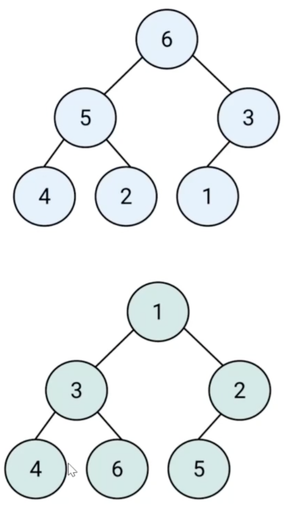
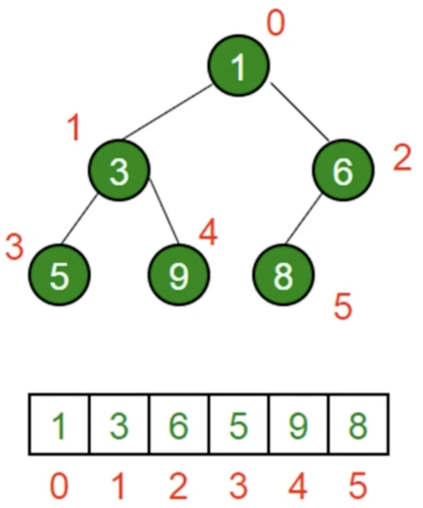

# 第10章数据结构之“堆”

## 10-1 堆简介

### 堆是什么

- 堆是一种特殊的**完全二叉树**
- 所有的节点都大于等于（最大堆）或小于等于（最小堆）它的子节点
  

### JS 中的堆

- JS 中通常用数组表示堆
- 左侧子节点的位置是 `2 * index + 1`
- 右侧子节点的位置是`2 * index + 2`
- 父节点位置是`(index - 1)/2`



### 堆的应用

- 堆能高效、快速地找出最大值和最小值，时间复杂度：O(1)
- 找出第 K 个最大（小）元素


### 第 K 个最大元素

- 构建一个最小堆，并将元素依次插入堆中
- 当堆的容量超过 K，就删除堆顶
- 插入结束后，堆顶就是第 K 个最大元素

## 10-2 JavaScript 实现：最小堆类

### 实现步骤

- 在类里，声明一个数组，用来装元素
- 主要方法：插入、删除堆顶、获取堆顶、获取堆大小

### 插入

- 将值插入堆的底部，即数组的尾部
- 然后上移：将这个值和它的父节点进行交换，直到父节点小于等于这个插入的值
- 大小为 k 的堆中插入元素的时间复杂度为 O(logk)

### 删除堆顶

- 用数组尾部元素替换堆顶（直接删除堆顶会破坏结构）
- 然后下移：将新堆顶和它的子节点进行交换，直到子节点大于等于这个新堆顶
- 大小为 k 的堆中删除堆顶的时间复杂度为 O(logk)

### 获取堆顶和堆的大小

- 获取堆顶：返回数组的头部
- 获取堆的大小：返回数组的长度

## 10-3 LeetCode：215.数组中的第 K 个最大元素

### 题目描述

在未排序的数组中找到第 k 个最大的元素。请注意，你需要找的是数组排序后的第 k 个最大的元素，而不是第 k 个不同的元素。

示例 1：

```
输入：[3,2,1,5,6,4] 和 k = 2
输出：5
```

示例 2：

```
输入：[3,2,3,1,2,4,5,5,6] 和 k = 4
输出：4
```

说明：
你可以假设 k 总是有效的，且 1 <= k <= 数组的长度

### 解题思路

- 看到"第 k 个最大元素"
- 考虑选择使用最小堆

### 解题步骤

- 构建一个最小堆，并依次把数组的值插入堆中
- 当堆的容量超过 k，就删除堆顶
- 插入结束后，堆顶就是第 k 个最大元素

```javascript
class MinHeap {
  constructor() {
    this.heap = [];
  }

  swap(i1, i2) {
    const temp = this.heap[i1];
    this.heap[i1] = this.heap[i2];
    this.heap[i2] = temp;
  }

  getParentIndex(i) {
    // return Math.floor((i-1)/2)
    return (i - 1) >> 1;
  }

  getLeftIndex(i) {
    return i * 2 + 1;
  }

  getRightIndex(i) {
    return i * 2 + 2;
  }

  shiftUp(index) {
    if (index === 0) return;
    const parentIndex = this.getParentIndex(index);
    if (this.heap[parentIndex] > this.heap[index]) {
      this.swap(parentIndex, index);
      this.shiftUp(parentIndex);
    }
  }

  shiftDown(index) {
    const leftIndex = this.getLeftIndex(index);
    const rightIndex = this.getRightIndex(index);
    if (this.heap[leftIndex] < this.heap[index]) {
      this.swap(leftIndex, index);
      this.shiftDown(index);
    }
    if (this.heap[rightIndex] < this.heap[index]) {
      this.swap(rightIndex, index);
      this.shiftDown(index);
    }
  }

  insert(value) {
    this.heap.push(value);
    this.shiftUp(this.heap.length - 1);
  }

  pop() {
    this.heap[0] = this.heap.pop();
    this.shiftDown(0);
  }

  peek() {
    return this.heap[0];
  }

  size() {
    return this.heap.length;
  }
}

/**
 * @param {number[]} nums
 * @param {number} k
 * @return {number}
 */
var findKthLargest = function (nums, k) {
  const h = new MinHeap();
  nums.forEach((n) => {
    h.insert(n);
    if (h.size() > k) {
      h.pop();
    }
  });
  return h.peek();
};
```
