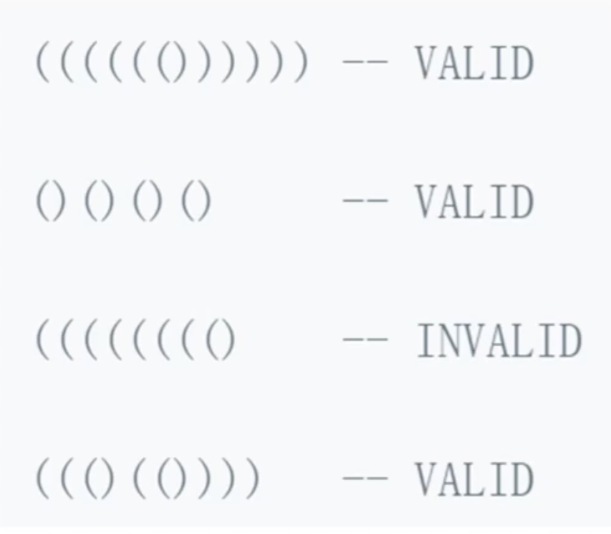
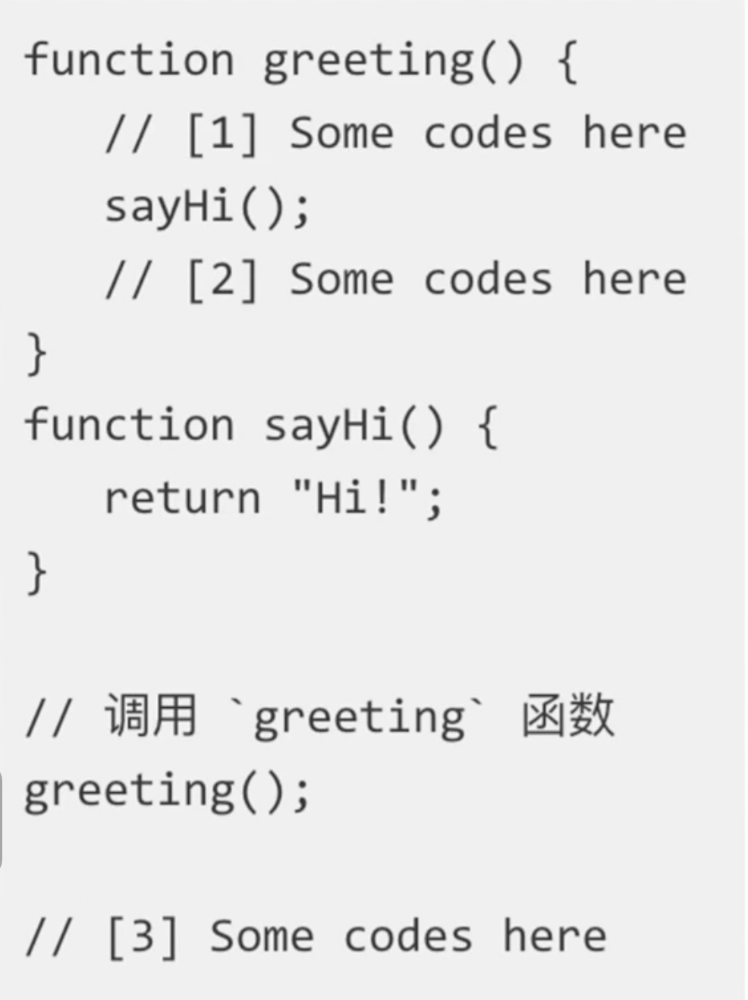

# 第3章数据结构之"栈"

## 3-1 栈简介

### 栈是什么


- 一个**后进先出**的数据结构
- JavaScript 中没有栈，但可以用 Array 实现栈的所有功能
- 出栈、入栈

```javascript
// stack.js

const stack = [];
stack.push(1);
stack.push(2);
const item1 = stack.pop();
const item2 = stack.pop();
```

## 3-2 什么场景下用栈

### 栈的应用场景

- 需要**后进先出**的场景
- 比如：二进制转二进制、判断字符串的括号是否有效、函数调用堆栈......

### 场景一：十进制转二进制


- 后出来的余数反而要排到前面
- 把余数依次入栈，然后再出栈，就可以实现余数倒序输出

### 场景二：有效的括号



- 越靠后的左括号，对应的右括号越靠前
- 左括号入栈，右括号出栈，最后栈空了就是合法的

### 函数调用堆栈



- 最后调用的函数，最先执行完
- JS 解释器使用栈来控制函数的调用顺序

## 3-3 LeetCode: 20.有效的括号

### 题目描述

```
给定一个只包括 '('，')'，'{'，'}'，'['，']' 的字符串 s ，判断字符串是否有效。

有效字符串需满足：

左括号必须用相同类型的右括号闭合。
左括号必须以正确的顺序闭合。
每个右括号都有一个对应的相同类型的左括号。


示例 1：

输入：s = "()"
输出：true
示例 2：

输入：s = "()[]{}"
输出：true
示例 3：

输入：s = "(]"
输出：false
```

### 解题思路

- 对于没有闭合的左括号而言，越靠后的左括号，对应的右括号越靠前
- 满足后进先出，考虑用栈

### 解题步骤

- 新建一个栈
- 扫描字符串，遇左括号入栈，遇到和栈顶括号类型匹配的右括号就出栈，类型不匹配直接判定为不合法
- 最后栈空了就合法，否则不合法

```javascript
/**
 * @param {string} s
 * @return {boolean}
 */
var isValid = function (s) {
  if (s.length % 2 === 1) {
    return false;
  }
  const stack = [];
  for (let i = 0; i < s.length; i++) {
    const c = s[i];
    if (c === "(" || c === "[" || c === "{") {
      stack.push(c);
    } else {
      const t = stack[stack.length - 1];
      if (
        (t === "(" && c === ")") ||
        (t === "[" && c === "]") ||
        (t === "{" && c === "}")
      ) {
        stack.pop();
      } else {
        return false;
      }
    }
  }
  return stack.length === 0;
};
```

## 3-4 前端与栈：JS 中的函数调用堆栈

```javascript
// callStack.js

const func1 = () => {
  func2();
};
const func2 = () => {
  func3();
};
const func3 = () => {};

func1();
```

## 3-5 栈-章节总结

### 技术要点

- 栈是一个后进先出的数据结构
- JavaScript 中没有栈，但可以用 Array 实现栈的所有功能
- 栈常用操作：push、pop、stack[stack.length-1]
