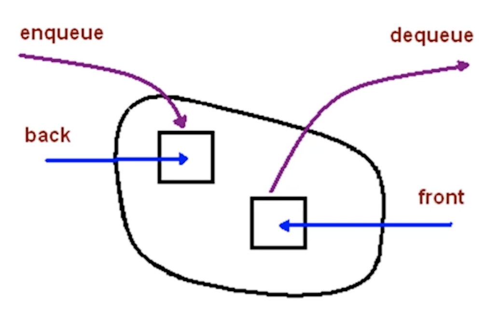
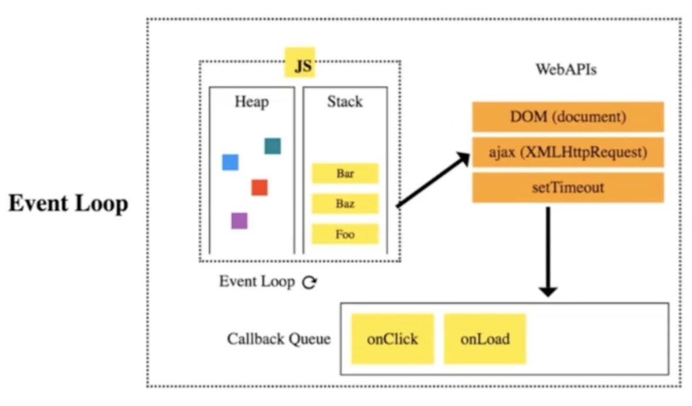

# 第4章数据结构之"队列"

## 4-1 队列简介

### 队列是什么



- 一个**先进先出**的数据结构
- JavaScript 中没有队列，但可以用 Array 实现队列的所有功能

```javascript
// queue.js
const queue = [];
queue.push(1);
queue.push(2);
const item1 = queue.shift();
const item2 = queue.shift();
```

## 4-2 什么场景用队列

### 队列的应用场景

- 需要**先进先出**的场景
- 比如：食堂排队打饭、JS 异步中的任务队列、计算最近请求次数

### 场景一：食堂排队打饭


- 食堂只留一个窗口，学生排队打饭似春运
- 先进先出，保证有序

### 场景二：JS 异步中的任务队列



- JS 是单线程，无法同时处理异步中的并发任务
- 使用任务队列先后处理异步任务

### 场景三：计算最近请求次数

```
输入：inputs = [[],[1],[100],[3001],[3002]]
输出：[null,1,2,3,3]
```

- 有新请求就入队，3000ms 前发出的请求出队
- 队列的长度就是最近请求次数

## 4-3 LeetCode：933.最近的请求次数

### 题目描述

```
写一个 RecentCounter 类来计算特定时间范围内最近的请求。

请你实现 RecentCounter 类：

1. RecentCounter() 初始化计数器，请求数为 0 。
2. int ping(int t) 在时间 t 添加一个新请求，其中 t 表示以毫秒为单位的某个时间，并返回过去 3000 毫秒内发生的所有请求数（包括新请求）。确切地说，返回在 [t-3000, t] 内发生的请求数。
保证每次对 ping 的调用都使用比之前更大的 t 值。


示例 1：

输入：
["RecentCounter", "ping", "ping", "ping", "ping"]
[[], [1], [100], [3001], [3002]]
输出：
[null, 1, 2, 3, 3]

解释：
RecentCounter recentCounter = new RecentCounter();
recentCounter.ping(1);     // requests = [1]，范围是 [-2999,1]，返回 1
recentCounter.ping(100);   // requests = [1, 100]，范围是 [-2900,100]，返回 2
recentCounter.ping(3001);  // requests = [1, 100, 3001]，范围是 [1,3001]，返回 3
recentCounter.ping(3002);  // requests = [1, 100, 3001, 3002]，范围是 [2,3002]，返回 3

```

### 解题思路

- 越早发出的请求越早不在最近 3000ms 内的请求里
- 满足先进先出，考虑用队列

### 解题步骤

- 有新请求就入队，3000ms 前发出的请求出队
- 队列的长度就是最近请求次数

```javascript
var RecentCounter = function () {
  this.q = [];
};

/**
 * @param {number} t
 * @return {number}
 */
RecentCounter.prototype.ping = function (t) {
  this.q.push(t);
  while (this.q[0] < t - 3000) {
    this.q.shift();
  }
  return this.q.length;
};
```

## 4-4 前端与队列：JS 异步中的任务队列

### 异步面试题

```javascript
setTimeout(() => console.log(1), 0);
console.log(2);
```

### 事件循环与任务队列


## 4-5 队列-章节总结

### 技术要点

- 队列是一个**先进先出**的数据结构
- JavaScript 中没有队列，但可以用 Array 实现队列的所有功能
- 队列常用操作：push、shift、queue[0]
