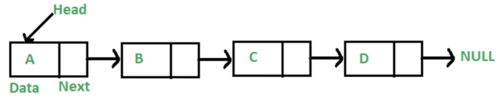

# 第5章数据结构之"链表"

## 5-1 链表简介

### 链表是什么

- 多个元素组成的列表
- 元素存储不连续，用 next 指针连在一起



### 数组 vs 链表

- 数组：增删非首尾元素时往往需要移动元素
- 链表：增删非首尾元素，不需要移动元素，只需要更改 next 的指向即可

### JS 中的链表

- JavaScript 中没有链表
- 可以用 Object 模拟链表

```javascript
// linkedList.js

const a = { val: "a" };
const b = { val: "b" };
const c = { val: "c" };
const d = { val: "d" };
a.next = b;
b.next = c;
c.next = d;

// 遍历链表
let p = a;
while(p) {
  console.log{p.val}
  p = p.next;
}

// 插入
const e = {val: 'e'}
c.next = e;
e.next = d

// 删除
c.next = d;
```

## 5-2 LeetCode：237.删除链表中的节点

### 题目描述

```
有一个单链表的 head，我们想删除它其中的一个节点 node。

给你一个需要删除的节点 node 。你将 无法访问 第一个节点  head。

链表的所有值都是 唯一的，并且保证给定的节点 node 不是链表中的最后一个节点。

删除给定的节点。注意，删除节点并不是指从内存中删除它。这里的意思是：

给定节点的值不应该存在于链表中。
链表中的节点数应该减少 1。
node 前面的所有值顺序相同。
node 后面的所有值顺序相同。
自定义测试：

对于输入，你应该提供整个链表 head 和要给出的节点 node。node 不应该是链表的最后一个节点，而应该是链表中的一个实际节点。
我们将构建链表，并将节点传递给你的函数。
输出将是调用你函数后的整个链表。


示例 1：


输入：head = [4,5,1,9], node = 5
输出：[4,1,9]
解释：指定链表中值为 5 的第二个节点，那么在调用了你的函数之后，该链表应变为 4 -> 1 -> 9
示例 2：


输入：head = [4,5,1,9], node = 1
输出：[4,5,9]
解释：指定链表中值为 1 的第三个节点，那么在调用了你的函数之后，该链表应变为 4 -> 5 -> 9
```

### 解题思路

```
4 -> 5 -> 1 -> 9
```

- 无法直接获取被删除节点的上个节点
- 将被删除节点转移到下个节点

### 解题步骤

- 将被删节点的值改为下个节点的值
- 删除下个节点

```javascript
/**
 * @param {ListNode} node
 * @return {void} Do not return anything, modify node in-place instead.
 */
var deleteNode = function (node) {
  node.val = node.next.val;
  node.next = node.next.next;
};
```

## 5-3 LeetCode：206.反转链表

### 题目描述

```
给你单链表的头节点 head ，请你反转链表，并返回反转后的链表。


示例 1：


输入：head = [1,2,3,4,5]
输出：[5,4,3,2,1]
示例 2：


输入：head = [1,2]
输出：[2,1]
示例 3：

输入：head = []
输出：[]

```

### 解题思路

- 反转两个节点：将 n+1 的 next 指向 n

```
输入：...->n->n+1->...
输出：...->n+1->n->...
```

- 反转多个节点：双指针遍历链表，重复上述操作

```
输入：1->2->3->4->5->NULL
输出：5->4->3->2->1->NULL
```

### 解题步骤

- 双指针一前一后遍历链表
- 反转双指针

```javascript
/**
 * Definition for singly-lined list.
 * function ListNode(val) {
 *      this.val = val;
 *      this.next = null;
 * }
 */
/**
 * @param {ListNode} head
 * @return {ListNode}
 */
var reverseList = function (head) {
  let p1 = head;
  let p2 = null;
  while (p1) {
    const tmp = p1.next;
    p1.next = p2;
    p2 = p1;
    p1 = tmp;
  }
  return p2;
};
```

## 5-4 LeetCode：2.两数相加

### 题目描述

```
给出两个非空的链表用来表示两个非负的整数。其中，它们各自的位数是按照逆序的方式存储的，并且它们的每个节点只能存储一位数字。
如果，我们将这两个数相加起来，则会返回一个新的链表来表示它们的和
您可以假设除了数字0之外，这两个数都不会以0开头
示例：
  输入：(2 -> 4 -> 3) + (5 -> 6 -> 4)
  输出：7 -> 0 -> 8
  原因：342 + 465 = 807
```

### 解题思路

- 小学数学题，模拟相加操作
- 需要遍历链表

### 解题步骤

- 新建一个空链表
- 遍历被相加的两个链表，模拟相加操作，将个位数追加到新链表上，将十位数留到下一位去相加

```javascript
/**
 * Definition for singly-lined list.
 * function ListNode(val) {
 *      this.val = val;
 *      this.next = null;
 * }
/**
 * @param {ListNode} l1
 * @param {ListNode} l2
 * @return {ListNode}
 */
var addTwoNumbers = function (l1, l2) {
  const l3 = new ListNode(0);
  let p1 = l1;
  let p2 = l2;
  let p3 = l3;
  let carry = 0;
  while (p1 || p2) {
    const v1 = p1 ? p1.val : 0;
    const v2 = p2 ? p2.val : 0;
    const val = v1 + v2 + 0;
    carry = Math.floor(val / 10);
    p3.next = new ListNode(val % 10);
    if (p1) p1 = p1.next;
    if (p2) p2 = p2.next;
    p3 = p3.next;
  }
  if (carry) {
    p3.next = new ListNode(carry);
  }
  return p3.next;
};
```

## 5-5 LeetCode：83.删除排序链表中的重复元素

### 题目描述

```
给定一个排序链表，删除所有重复的元素，使得每个元素只出现一次

示例1：
  输入：1 -> 1 -> 2
  输出：1 -> 2

示例2：
  输入：1 -> 1 -> 2 -> 3 -> 3
  输出：1 -> 2 -> 3
```

### 解题思路

- 因为链表是有序的，所以重复元素一定相邻
- 遍历链表，如果发现当前元素和下个元素值相同，就删除下个元素值

### 解题步骤

- 遍历链表，如果发现当前元素和下个元素值相同，就删除下个元素值
- 遍历结束后，返回原链表的头部

```javascript
/**
 * Definition for singly-lined list.
 * function ListNode(val) {
 *      this.val = val;
 *      this.next = null;
 * }
/**
 * @param {ListNode} head
 * @return {ListNode}
 */
var deleteDuplicates = function (head) {
  let p = head;
  while (p && p.next) {
    const val1 = p.val;
    const val2 = p.next.val;
    if (val1 === val2) {
      p.next = p.next.next;
    } else {
      p = p.next;
    }
  }
  return head;
};
```

## 5-6 LeetCode：141.环形链表

### 题目描述

```
给定一个链表，判断链表中是否有环。
为了表示给定链表中的环，我们使用整数 pos 来表示链表尾连接到链表中的位置（索引从0开始）。如何 pos 是 -1，则在该链表中没有环

示例1：
  输入：head = [3,2,0,-4], pos = 1
  输出：true
  解释：链表中有一个环，其尾部连接到第二个节点

示例2：
  输入：head = [1,2], pos = 0
  输出：true
  解释：链表中有一个环，其尾部连接到第一个节点

示例3：
  输入：head = [1], pos = -1
  输出：false
  解释：链表中没有环
```

### 解题思路

- 两个人在圆形操场上的起点同时起跑，速度快的人一定会超过速度慢的人一圈
- 用一快一慢两个指针遍历链表，如果指针能够相逢，那么链表就有圈

### 解题步骤

- 用一快一慢两个指针遍历链表，如果指针能够相逢，就返回 true
- 遍历结束后，还没有相逢就返回 false

```javascript
/**
 * Definition for singly-lined list.
 * function ListNode(val) {
 *      this.val = val;
 *      this.next = null;
 * }
/**
 * @param {ListNode} head
 * @return {boolean}
 */
var hasCycle = function (head) {
  let p1 = head;
  let p2 = head;
  while (p1 && p2 && p2.next) {
    p1 = p1.next;
    p2 = p2.next.next;
    if (p1 === p2) {
      return true;
    }
  }
  return false;
};
```

## 5-7 前端与链表：JS 中的原型链

### 原型链简介

- 原型链的本质是链表
- 原型链上的节点是各种原型对象，比如`Function.prototype、Object.prototype`......
- 原型链通过`__proto__`属性连接各种原型对象

### 原型链长啥样

- obj -> Object.prototype -> null
- func -> Function.prototype -> Object.prototype -> null
- arr -> Array.prototype -> Object.prototype -> null

```javascript
// proto.js

const obj = {};
const func = () => {};
const arr = [];
```

### 原型链知识点

- 如果 A 沿着原型链能找到 B.prototype，那么 A instanceOf B 为 true
- 如何在 A 对象上没有找到 x 属性，那么会沿着原型链找 x 属性

### 面试题一

> instanceOf 的原理，并用代码实现

#### 面试题一分析

- 知识点：如果 A 沿着原型链能找到 B.prototype，那么 A instanceOf B 为 true
- 解法：遍历 A 的原型链，如果找到 B.prototype，返回 true，否则返回 false

```javascript
const instanceOf = (A, B) => {
  let p = A;
  while (p) {
    if (p === B.prototype) {
      return true;
    }
    p = p.__proto__;
  }
  return false;
};
```

### 面试题二

```javascript
var foo = {},
  F = function () {};
Object.prototype.a = "value a";
Function.prototype.b = "value b";

console.log(foo.a);
console.log(foo.b);

console.log(F.a);
console.log(F.b);
```

#### 面试题二分析

- 知识点：如果在 A 对象上没有找到 x 属性，那么会沿着原型链找 x 属性
- 解法：明确 foo 和 F 变量的原型链，没着原型链找 a 属性和 b 属性

## 5-8 前端与链表：使用链表指针获取 JSON 的节点

```javascript
const json = {
  a: { b: { c: 1 } },
  d: { e: 2 },
};
const path = ["a", "b", "c"];

let p = json;
path.forEach((k) => {
  p = p[k];
});
```

## 5-9 链表-章节总结

### 技术要点

- 链表里的元素存储不是连续的，之间通过 next 连接
- JavaScript 中没有链表，但是可以用 Object 模拟链表
- 链表常用操作：修改 next、遍历链表

- JS 中的原型链也是一个链表
- 使用链表指针可以获取 JSON 的节点值
