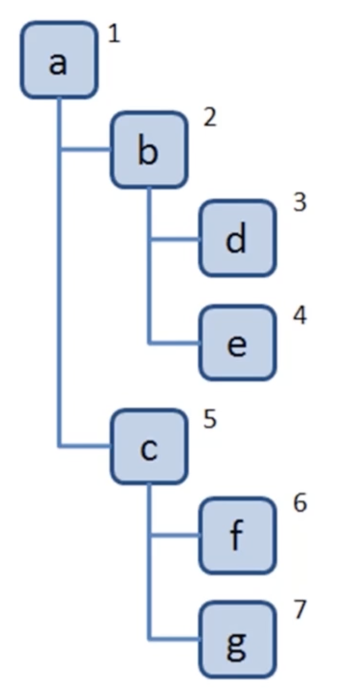
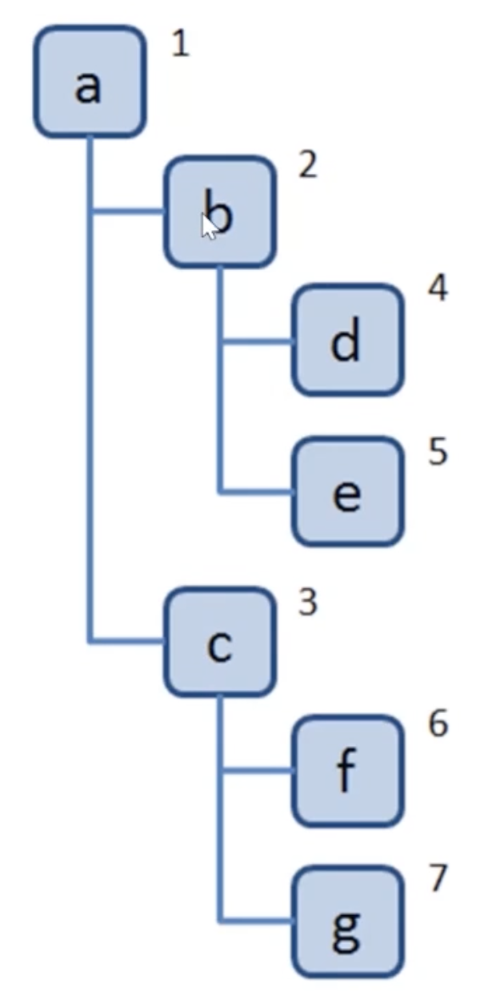
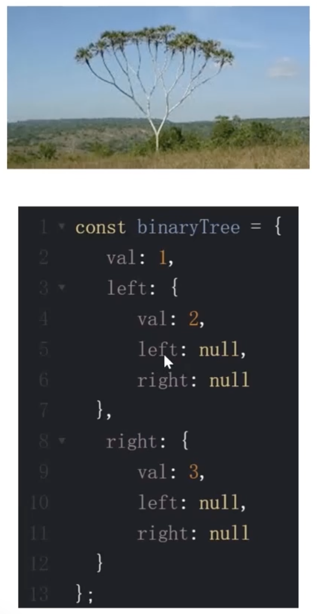
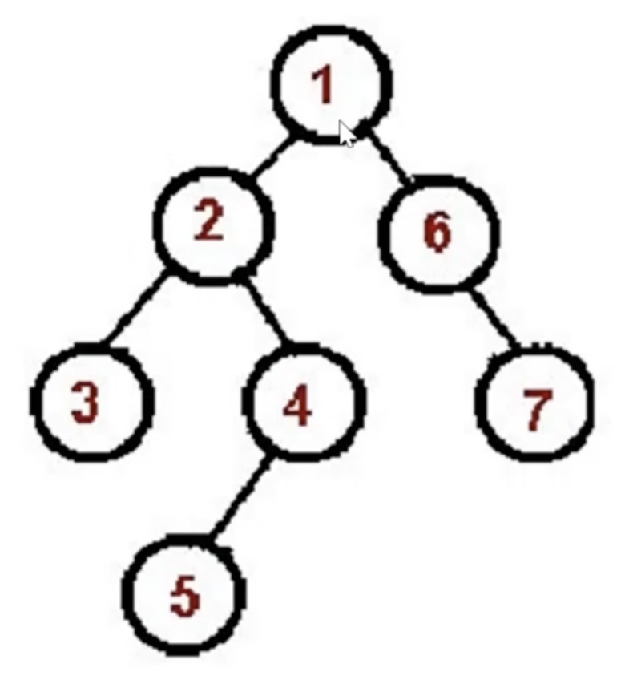
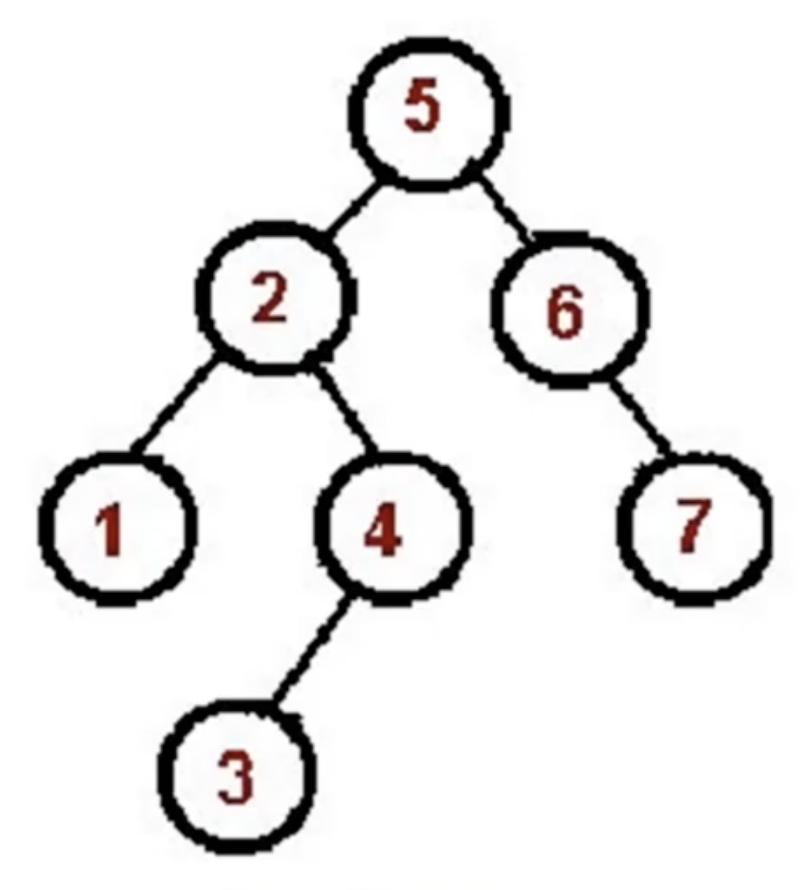
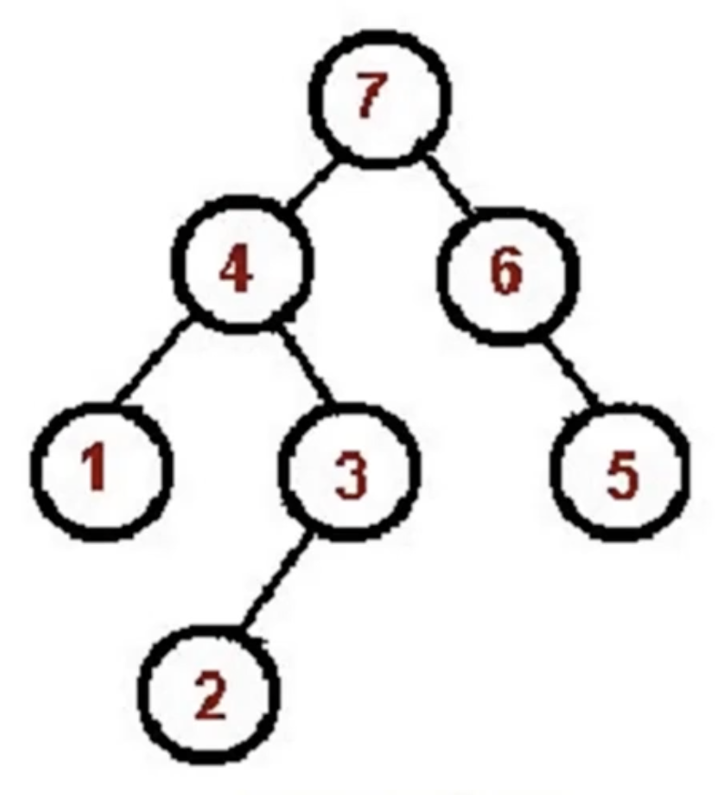

# 第8章数据结构之“树”

## 8-1 树简介

### 树是什么

- 一种**分层**数据的抽象模型
- 前端工作中觉的树包括：DOM 树、级联选择、树形控件......
- JS 中没有树，但是可以用 Objcet 和 Array 构建树
  ```
  {
    value: 'zhejiang'，
    label: 'zhejiang'，
    children: [
      {
        value: 'hangzhou'，
        label: 'Hangzhou'，
        children: [
          {
            value: 'xihu'，
            label: 'West Lake'，
          },
        ],
      },
    ],
  }
  ```
- 树的常用操作：深度/广度优先遍历、先中后序遍历

## 8-2 深度与广度优先遍历

### 什么是深度/广度优先遍历

- 深度优先遍历：尽可能深的搜索树的分支
  
- 广度优先遍历：先访问离根节点最近的节点
  

### 深度优先遍历算法口诀

- 访问根节点
- 对根节点的 children 挨个进行深度优先遍历

```javascript
// dfs.js
const tree = {
  val: "a",
  children: [
    {
      val: "b",
      children: [
        {
          val: "d",
          children: [],
        },
        {
          val: "e",
          children: [],
        },
      ],
    },
    {
      val: "c",
      children: [
        {
          val: "f",
          children: [],
        },
        {
          val: "g",
          children: [],
        },
      ],
    },
  ],
};

const dfs = (root) => {
  console.log(root.val);
  root.children.forEach(dfs);
};

dfs(tree);
```

### 广度优先遍历算法口诀

- 新建一个队列，把根节点入队
- 把队头出队并访问
- 把队头的 children 挨个入队
- 重复第二、三步，直到队列为空

```javascript
// bfs.js
const tree = {
  val: "a",
  children: [
    {
      val: "b",
      children: [
        {
          val: "d",
          children: [],
        },
        {
          val: "e",
          children: [],
        },
      ],
    },
    {
      val: "c",
      children: [
        {
          val: "f",
          children: [],
        },
        {
          val: "g",
          children: [],
        },
      ],
    },
  ],
};

const bfs = (root) => {
  const q = [root];
  while (q.length > 0) {
    const n = q.shift();
    console.log(n.val);
    n.children.forEach((child) => q.push(child));
  }
};

bfs(tree);
```

## 8-3 二叉树的先中后序遍历

### 二叉树是什么



- 树中每个节点最多只能有两个子节点
- 在 JS 中通常用 Object 来模拟二叉树

### 先序遍历算法口诀



- 访问**根**节点
- 对根节点的**左**子树进行先序遍历
- 对根节点的**右**子树进行先序遍历

```javascript
// preorder.js
const bt = {
  val: 1,
  left: {
    val: 2,
    left: {
      val: 4,
      left: null,
      right: null,
    },
    right: {
      val: 5,
      left: null,
      right: null,
    },
  },
  right: {
    val: 3,
    left: {
      val: 6,
      left: null,
      right: null,
    },
    right: {
      val: 7,
      left: null,
      right: null,
    },
  },
};

const preorder = (root) => {
  if (!root) return;
  console.log(root.val);
  preorder(root.left);
  preorder(root.right);
};

preorder(bt);
```

### 中序遍历算法口诀



- 对根节点的**左**子树进行先序遍历
- 访问**根**节点
- 对根节点的**右**子树进行先序遍历

```javascript
const bt = {
  val: 1,
  left: {
    val: 2,
    left: {
      val: 4,
      left: null,
      right: null,
    },
    right: {
      val: 5,
      left: null,
      right: null,
    },
  },
  right: {
    val: 3,
    left: {
      val: 6,
      left: null,
      right: null,
    },
    right: {
      val: 7,
      left: null,
      right: null,
    },
  },
};

const inorder = (root) => {
  if (!root) return;
  inorder(root.left);
  console.log(root.val);
  inorder(root.right);
};

inorder(bt);
```

### 后序遍历算法口诀



- 对根节点的**左**子树进行先序遍历
- 对根节点的**右**子树进行先序遍历
- 访问**根**节点

```javascript
const bt = {
  val: 1,
  left: {
    val: 2,
    left: {
      val: 4,
      left: null,
      right: null,
    },
    right: {
      val: 5,
      left: null,
      right: null,
    },
  },
  right: {
    val: 3,
    left: {
      val: 6,
      left: null,
      right: null,
    },
    right: {
      val: 7,
      left: null,
      right: null,
    },
  },
};

const postorder = (root) => {
  if (!root) return;
  postorder(root.left);
  postorder(root.right);
  console.log(root.val);
};

postorder(bt);
```

## 8-4 二叉树的先中后序遍历（非递归版）

### 先序遍历

```javascript
// preorder.js
const bt = {
  val: 1,
  left: {
    val: 2,
    left: {
      val: 4,
      left: null,
      right: null,
    },
    right: {
      val: 5,
      left: null,
      right: null,
    },
  },
  right: {
    val: 3,
    left: {
      val: 6,
      left: null,
      right: null,
    },
    right: {
      val: 7,
      left: null,
      right: null,
    },
  },
};

const preorder = (root) => {
  if (!root) return;
  const stack = [root];
  while (stack.length) {
    const n = stack.pop();
    console.log(n.val);
    if (n.right) stack.push(n.right);
    if (n.left) stack.push(n.left);
  }
};

preorder(bt);
```

### 中序遍历

```javascript
// inorder.js
const bt = {
  val: 1,
  left: {
    val: 2,
    left: {
      val: 4,
      left: null,
      right: null,
    },
    right: {
      val: 5,
      left: null,
      right: null,
    },
  },
  right: {
    val: 3,
    left: {
      val: 6,
      left: null,
      right: null,
    },
    right: {
      val: 7,
      left: null,
      right: null,
    },
  },
};

const inorder = (root) => {
  if (!root) return;
  const stack = [];
  let p = root;
  while (stack.length || p) {
    while (p) {
      stack.push(p);
      p = p.left;
    }
    const n = stack.pop();
    console.log(n.val);
    p = n.right;
  }
};

inorder(bt);
```

### 后序遍历

```javascript
// postorder.js
const bt = {
  val: 1,
  left: {
    val: 2,
    left: {
      val: 4,
      left: null,
      right: null,
    },
    right: {
      val: 5,
      left: null,
      right: null,
    },
  },
  right: {
    val: 3,
    left: {
      val: 6,
      left: null,
      right: null,
    },
    right: {
      val: 7,
      left: null,
      right: null,
    },
  },
};

const postorder = (root) => {
  if (!root) return;
  console.log(root.val);
  preorder(root.left);
  preorder(root.right);
};

postorder(bt);
```

## 8-5 LeetCode：104.二叉树的最大深度

## 8-6 LeetCode：111.二叉树的最小深度

## 8-7 LeetCode：102.二叉树的层序遍历

## 8-8 LeetCode：94.二叉树的中序遍历

## 8-9 LeetCode：112.路径总和

## 8-10 前端与树：遍历 JSON 的所有节点值

## 8-11 前端与树：渲染 Antd 中的树组件

## 8-12 树-章节总结
