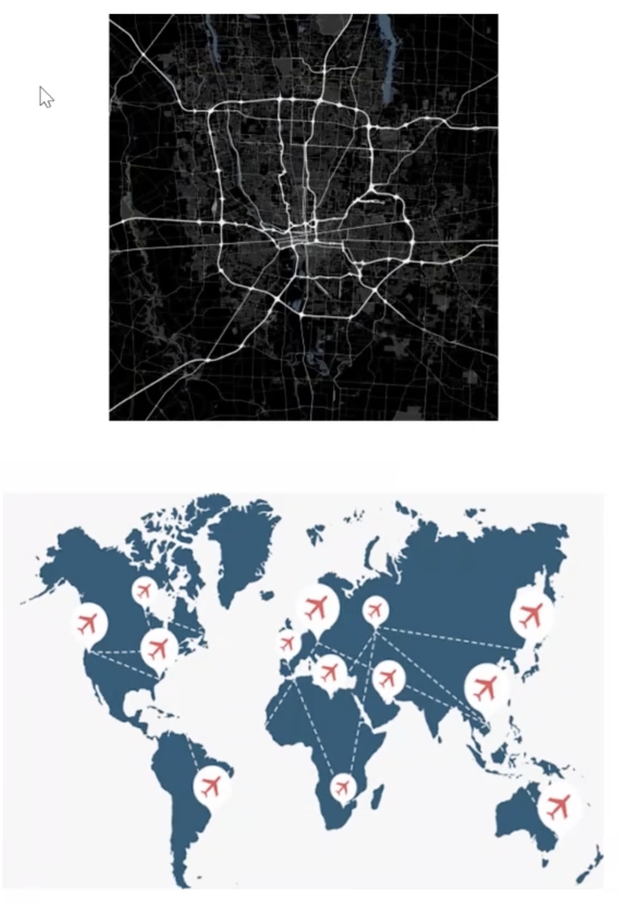
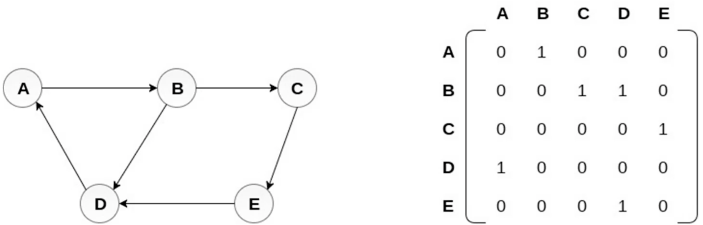
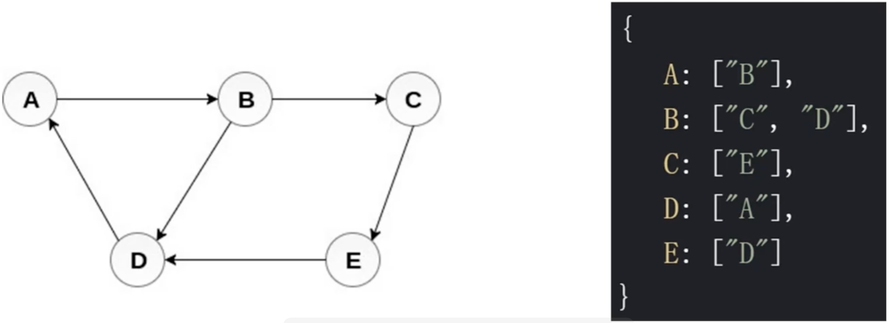
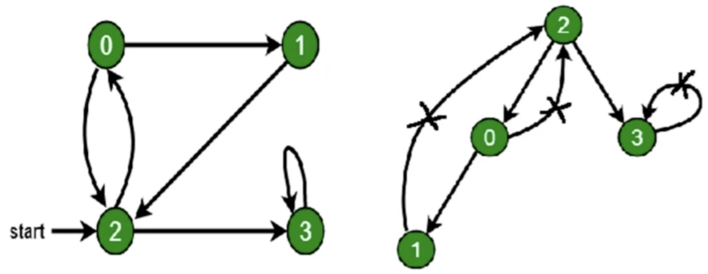
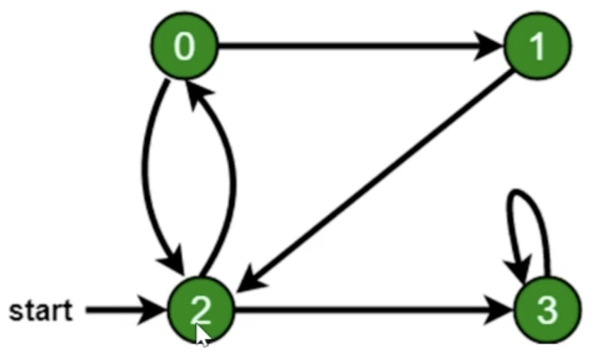

# 第9章数据结构之“图”

## 9-1 图简介

### 图是什么



- 图是**网络结构**的抽象模型，是一组由**边**连接的**节点**
- 图可以表示任何二元关系，比如道路、航班......
- JS 中没有图，但是可以用 Object 和 Array 构建图
- 图的表示法：邻接矩阵、邻接表、关联矩阵......

### 图的表示法：邻接矩阵



### 图的表示法：邻接表



### 图的常用操作

- 深度优先遍历
- 广度优先遍历

## 9-1 图的深度广度优先遍历

### 什么是深度/广度优先遍历

- 深度优先遍历：尽可能深的搜索图的分支
- 广度优先遍历：先访问离根节点最近的节点

### 深度优先遍历算法口诀

- 访问根节点
- 对根节点的**没访问过的相邻节点**挨个进行深度优先遍历



```javascript
/// dfs.js
const graph = {
  0: [1, 2],
  1: [2],
  2: [0, 3],
  3: [3],
};

const visisted = new Set();
const dfs = (n) => {
  console.log(n);
  visisted.add(n);
  graph[n].forEach((c) => {
    if (!visisted.has(c)) {
      dfs(c);
    }
  });
};
dfs(2);
```

### 广度优先遍历算法口诀

- 新建一个队列，把根节点入队
- 把队头出队并访问
- 把队头的**没访问过的相邻节点**入队
- 重复第二、三步，直到队列为空



```javascript
/// bfs.js
const graph = {
  0: [1, 2],
  1: [2],
  2: [0, 3],
  3: [3],
};

const visisted = new Set();
visisted.add(2);
const q = [2];

while (q.length) {
  const n = q.shift();
  console.log(n);
  graph[n].forEach((c) => {
    if (!visisted.has(c)) {
      q.push(c);
      visisted.add(c);
    }
  });
}
```
