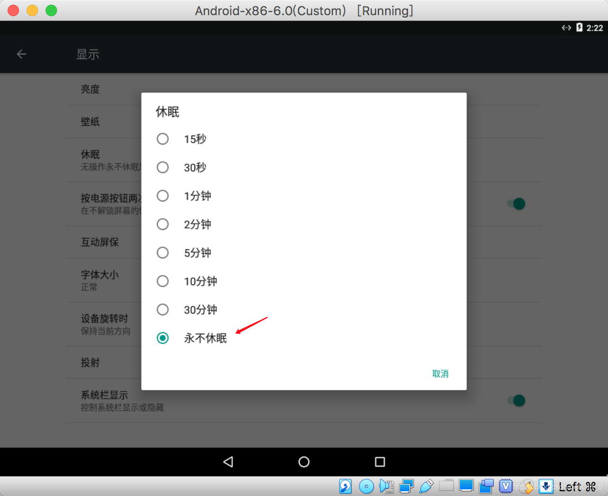
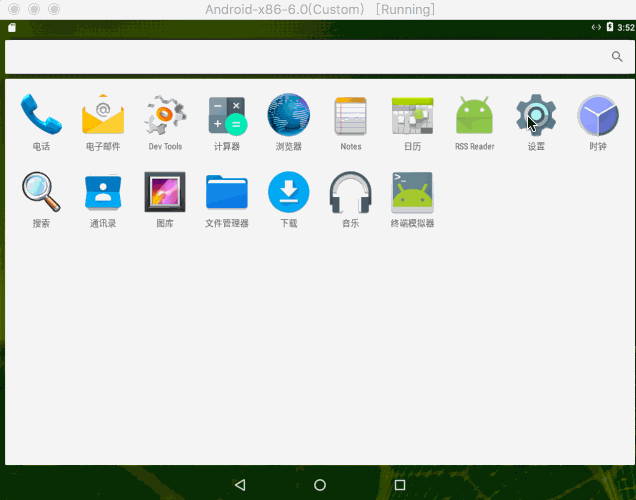

## 需求确立

### 描述

一般， Kiosk 模式下不管处于什么界面，都要求屏幕保持常亮的。虽然在 App 内可以通过代码实现屏幕常亮，但是现在的需求是在系统设置里增加永不休眠的功能，可勾选的实现动态修改。涉及到系统 Apk 的修改，没办法只能去修改源码了。

### 确认

简单整理下需求：

- 针对 Settings.apk 设置 -> 显示 -> 睡眠功能，添加永不休眠选项，支持切换休眠为永不休眠
- 实现开机默认选中永不休眠，并且开启永不休眠功能

## 功能实现

源码过于庞大，不可能去分析每行代码。通过 Google 查阅资料，基本定位实现该功能所需要修改的文件，主要是`PowerManagerService.java`和`DisplaySettings.java`两个文件，现在就具体讲讲实现永不休眠功能的步骤。

### 添加永不休眠选项

Settings.apk 已经实现休眠功能，首先需要在选项里添加永不休眠选项，仅支持英文和中文

找到`packages/apps/Settings/res/values-zh-rCN/arrays.xml`文件，搜索 `screen_timeout_entries`，插入`<item>"永不休眠"</item>`代码。示例如下：

```
<string-array name="screen_timeout_entries">
  <item msgid="3342301044271143016">"15秒"</item>
  <item msgid="8881760709354815449">"30秒"</item>
  <item msgid="7589406073232279088">"1分钟"</item>
  <item msgid="7001195990902244174">"2分钟"</item>
  <item msgid="7489864775127957179">"5分钟"</item>
  <item msgid="2314124409517439288">"10分钟"</item>
  <item msgid="6864027152847611413">"30分钟"</item>
  <item>"永不休眠"</item>
</string-array>
```

找到`packages/apps/Settings/res/values/arrays.xml`文件，搜索 `screen_timeout_entries`，插入`<item>Never</item>`代码，搜索`screen_timeout_values`,插入`<item>0</item>`代码。示例如下：

```
<!-- Display settings.  The delay in inactivity before the screen is turned off. These are shown in a list dialog. -->
<string-array name="screen_timeout_entries">
    <item>15 seconds</item>
    <item>30 seconds</item>
    <item>1 minute</item>
    <item>2 minutes</item>
    <item>5 minutes</item>
    <item>10 minutes</item>
    <item>30 minutes</item>
    <item>Never</item>
</string-array>

<!-- Do not translate. -->
<string-array name="screen_timeout_values" translatable="false">
    <!-- Do not translate. -->
    <item>15000</item>
    <!-- Do not translate. -->
    <item>30000</item>
    <!-- Do not translate. -->
    <item>60000</item>
    <!-- Do not translate. -->
    <item>120000</item>
    <!-- Do not translate. -->
    <item>300000</item>
    <!-- Do not translate. -->
    <item>600000</item>
    <!-- Do not translate. -->
    <item>1800000</item>
    <!-- Do not translate. -->
    <item>0</item>
</string-array>
```



### 默认选中永不休眠选项

默认休眠时间是 1 分钟，现在修改为永不休眠

找到`frameworks/base/packages/SettingsProvider/res/values/defaults.xml`文件，
将`<integer name="def_screen_off_timeout">60000</integer>`替换为`<integer name="def_screen_off_timeout">0</integer>`即可。示例如下：

```
 <resources>
     <bool name="def_dim_screen">true</bool>
-    <integer name="def_screen_off_timeout">60000</integer>
+    <integer name="def_screen_off_timeout">0</integer>
     <integer name="def_sleep_timeout">-1</integer>
     <bool name="def_airplane_mode_on">false</bool>
     <bool name="def_theater_mode_on">false</bool>
```

### 实现永不休眠功能

1.找到`packages/apps/Settings/src/com/android/settings/DisplaySettings.java`中的`updateTimeoutPreferenceDescription`，修改如下：

```
private void updateTimeoutPreferenceDescription(long currentTimeout) {
    ListPreference preference = mScreenTimeoutPreference;
    String summary;

    /* never screen off begin */
    final CharSequence[] entries = preference.getEntries();
    final CharSequence[] values = preference.getEntryValues();
    /* never screen off end */

    if (currentTimeout < 0) {
        // Unsupported value

        /* never screen off begin */
        if (entries != null || entries.length != 0){
            summary = (entries[entries.length-1]).toString();
        }else{
            summary = "";
        }
        /* never screen off end */
    } else {

        if (entries == null || entries.length == 0) {
            summary = "";
        } else {
            int best = 0;
            for (int i = 0; i < values.length; i++) {
                long timeout = Long.parseLong(values[i].toString());
                if (currentTimeout == timeout) {
                    best = i;
                }
            }

            if (entries.length != 0) {
                summary = preference.getContext().getString(R.string.screen_timeout_summary,
                    entries[best]);
            } else {
                summary = "";
            }
        }
    }
    preference.setSummary(summary);
}
```

2.找到`frameworks/base/services/core/java/com/android/server/power/PowerManagerService.java`中的`getScreenOffTimeoutLocked`方法，修改如下：

```
private int getScreenOffTimeoutLocked(int sleepTimeout) {
    int noSleepTimeout = 0;
    int timeout = mScreenOffTimeoutSetting;
    if (isMaximumScreenOffTimeoutFromDeviceAdminEnforcedLocked()) {
        timeout = Math.min(timeout, mMaximumScreenOffTimeoutFromDeviceAdmin);
    }
    if (mUserActivityTimeoutOverrideFromWindowManager >= 0) {
        timeout = (int)Math.min(timeout, mUserActivityTimeoutOverrideFromWindowManager);
    }
    if (sleepTimeout >= 0) {
        timeout = Math.min(timeout, sleepTimeout);
    }
    /* never screen off begin */
    noSleepTimeout = mScreenOffTimeoutSetting;
    if (noSleepTimeout == 0) {
        noSleepTimeout = mMaximumScreenOffTimeoutFromDeviceAdmin;
        return Math.max(noSleepTimeout, mMaximumScreenOffTimeoutFromDeviceAdmin);
    }
    /* never screen off end */
    return Math.max(timeout, mMinimumScreenOffTimeoutConfig);
}
```

## 小结



如何从源码上实现永不休眠功能，具体实现也就这样了，这里仅是简单记录下。

[Android-6.0 永不休眠补丁](https://download.csdn.net/download/ctrl_s/11107534)，提供下载
