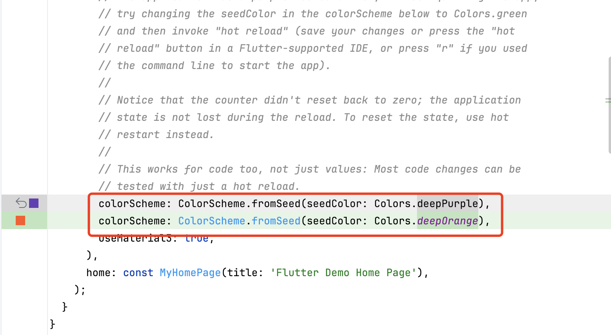

---
prev:
  text: '实现Dart版本对象存储(COS)插件'
  link: '/flutter/实现Dart版本对象存储(COS)插件/index'
next: false  
---
# Shorebird 热更新教程

## 官网

https://docs.shorebird.dev/

## 注意

- 一定要科学上网
- Terminal 也要确处于科学上网环境

## 安装

```shell
curl --proto '=https' --tlsv1.2 https://raw.githubusercontent.com/shorebirdtech/install/main/install.sh -sSf | bash
```

在`Terminal`执行安装命令，安装`shorebird cli`


安装完成后，执行`shorebird doctor`验证是否安装成功

## 登录

```shell
shorebird login
```

在`Terminal`执行登录命令


登录我使用的是`Google`登录，在浏览器打开授权链接进行授权即可。

## 初始化

### 命令

```shell
shorebird init
```

在`Terminal`定位到工程的根目录，执行初始化命令

### 结果


执行成功后，

- 工程根目录下会自动生成`shorebird.yaml`文件，里面保存了`app_id`信息，并且被`pubspec.yaml`引用
- Android 目录下的`AndroidManifest.xml`文件会自动添加`INTERNET`权限
- 在 [Shorebird Console](https://console.shorebird.dev/apps/1ae08317-f6ad-459d-9b42-783bc6694a4c?tab=releases)控制台自动创建一个应用，关联的就是你的本地工程

## Android 端

### 发布版本

#### 命令

```shell
shorebird release android
```

在`Terminal`定位到工程的根目录，执行发布 android 版本命令

#### 问题一


若遇到此问题，应该是网络情况问题，重试下就好了。

#### 问题二


若遇到此问题，具体详情查看[issue](https://github.com/shorebirdtech/updater/issues/175)， 解决方案：

- 执行`md5 ~/.shorebird/bin/cache/artifacts/bundletool/bundletool.jar`,验证 md5 结果是否等于`d91230a986d4a990e7bb69351b9e9464`
- 若不是，去下载[bundletool-all-1.15.6.jar](https://github.com/google/bundletool/releases/download/1.15.6/bundletool-all-1.15.6.jar)文件
- 去`~/.shorebird/bin/cache/artifacts/bundletool/`目录，使用`bundletool-all-1.15.6.jar`替换`bundletool.jar`文件即可

#### 结果


1. `android`打包成功后，显示当前 app 版本、平台类型、flutter 版本信息
2. `输入y`继续下一步，将版本上传到[Shorebird Console](https://console.shorebird.dev/apps/1ae08317-f6ad-459d-9b42-783bc6694a4c?tab=releases)控制台
3. 版本上传并发布成功后，显示版本信息，可以在[Shorebird Console](https://console.shorebird.dev/apps/1ae08317-f6ad-459d-9b42-783bc6694a4c?tab=releases)查看
4. 使用` shorebird patch --platforms=android --release-version=1.0.0+1`命令基于`1.0.0+1`打包补丁

### 修改代码



这里简单修改下`app`的主题颜色和计数器的步长

### 发布补丁

#### 命令

```shell
shorebird patch --platforms=android --release-version=1.0.0+1
```

在`Terminal`定位到工程的根目录，执行发布 android 补丁命令

#### 结果


1. `android`补丁生成成功后，显示当前 app 版本、平台 cup 架构信息
2. `输入y`继续下一步，将补丁上传至[Shorebird Console](https://console.shorebird.dev/)控制台
3. 补丁上传成功

## iOS 端

### 发布版本

#### 命令

```shell
shorebird release ios --export-method development
```

在`Terminal`定位到工程的根目录，执行发布 ios 版本命令，这里构建的是针对注册了 Apple 开发者帐户的开发设备的测试包，构建之前，请在 xcode 中配置好证书。

#### 结果


1. `ios`打包成功后，显示当前 app 版本、平台类型、flutter 版本信息
2. `输入y`继续下一步，将版本上传到[Shorebird Console](https://console.shorebird.dev/)控制台
3. 版本上传并发布成功后，显示版本信息，可以在[Shorebird Console](https://console.shorebird.dev/)查看
4. 使用`shorebird patch --platforms=ios --release-version=1.0.0+2 --export-method development`命令基于`1.0.0+2`打包补丁

### 修改代码


这里简单修改下`app`的主题颜色和计数器的步长

### 发布补丁

#### 命令

```shell
shorebird patch --platforms=ios --release-version=1.0.0+2 --export-method development
```

在`Terminal`定位到工程的根目录，执行发布 ios 补丁命令

#### 问题一


若遇到此问题，具体详情查看[issue](https://github.com/shorebirdtech/shorebird/issues/1771)， 解决方案：

- 下载[aot-tools.dill](https://storage.googleapis.com/download.shorebird.dev/shorebird/ef99b23fc158eca48dd9ecb76a819329985ad628/aot-tools.dill)文件
- 去`~/.shorebird/bin/cache/artifacts/aot-tools/ef99b23fc158eca48dd9ecb76a819329985ad628/`目录，使用刚下载的`aot-tools.dill`替换`aot-tools.dill`文件即可

#### 结果


1. `ios`补丁生成成功后，显示当前 app 版本、平台 cup 架构信息
2. `输入y`继续下一步，将补丁上传至[Shorebird Console](https://console.shorebird.dev/)控制台
3. 补丁上传成功

## 成果


可以看到，app 第二次打开后主题颜色从**紫色变成橙色、计数器的步长从 1 变成 2**，热更新成功。
