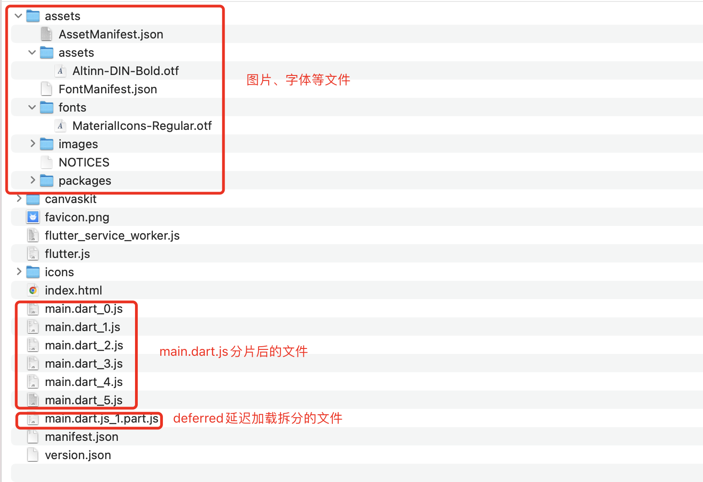

# Flutter Web 在《一起漫部》的性能优化探索与实践

[一起漫部](https://apph5.yiqimanbu.cn/) 是基于区块链技术创造的新型数字生活。

## 目录

- [前言](#前言)
- [开发环境](#开发环境)
- [渲染模式](#渲染模式)
- [首屏白屏](#首屏白屏)
- [优化方案](#优化方案)
  - [启屏页优化](#启屏页优化)
  - [包体积优化](#包体积优化)
    - [去除无用的 icon](#去除无用的icon)
    - [裁剪字体文件](#裁剪字体文件)
    - [deferred 延迟加载](#deferred延迟加载)
    - [启用 gzip 压缩](#启用gzip压缩)
  - [加载优化](#加载优化)
    - [大文件分片下载](#大文件分片下载)
    - [资源文件 hash 化](#资源文件hash化)
    - [资源文件 cdn 化](#资源文件cdn化)
- [成果](#成果)
- [参考链接](#参考链接)
- [总结](#总结)

## 前言

不久前，App 小组面临一场开发挑战，即『一起漫部』需要在 App 的基础上开发出一套 H5 版本。

由于一起漫部 App 版本是使用 Flutter 技术开发的，对于 H5 版本的技术选型，Flutter Web 成为我们的第一选择对象。
通过调研， 我们了解到在 Flutter 1.0 发布会上由介绍如何让 Flutter 运行在 Web 上而提出 Flutter Web 的概念，
到 Flutter1.5.4 版本推出 Flutter Web 的预览版，到 Flutter 2.0 官方宣布 Flutter Web 现已进入稳定版，
再到如今 Flutter 对 Web 的不断更新，我们看到了 Flutter Web 的发展优势。同时，为了复用现有 App 版本的代码，
我们团队决定尝试使用 Flutter Web 来完成一起漫部 H5 版本的开发。

经过 App 组小伙伴的共同努力，一起漫部在 Flutter Web 的支持下完成了 H5 端的复刻版本，使 H5 端保持了和 App
同样的功能以及交互体验。 在项目实践过程中，Flutter Web 带来的整体验还不错，但依然存在较大的性能问题，主要体现
在**首屏渲染时间长，用户白屏体验差**， 本篇文章也将围绕此问题，分析一起漫部是如何逐步优化，提升用户体验的。

## 开发环境

分析性能问题之前，简单介绍下所使用的开发环境，主要包括设备环境、Flutter 环境和 Nginx 环境三方面。

### 设备环境


### Flutter 环境


如图所示，我们团队是在 Flutter 3.0.5 版本上进行 App to Web 的工作。

### Nginx 环境


```text
    server {
       listen       9090;
       server_name  localhost;

       location / {
            root   /build/web;
            index  index.html index.htm;
            try_files $uri $uri/ /index.html;
       }

       location /api {
            proxy_pass xxx-xxx-xxx; # your server domain
       }
    }
```

为了方便发布测试，我在本地搭建了一个 nginx 服务器，版本是 1.21.6，同时新建了个 server 配置，将本地 9090 端口
指向 Flutter Web 打包产物的根路径，当在浏览器输入`http://localhost:9090/` 即可正常访问一起漫部 Web 应用，
具体的的 server 配置见上图。

## 渲染模式

对开发环境有了大概了解后，我们再学习下如何构建 Flutter Web 应用。

官方提供了`Flutter build web`命令来构建 Web 应用，并且支持 canvaskit、html 两种渲染器模式，
通过`--web-renderer`参数来选择使用。

### canvaskit

当使用 canvaskit 渲染器模式时，flutter 将 Skia 编译成 WebAssembly 格式，并使用 WebGL 渲染元素

- 优点：渲染性能更好，跨端一致性高，
- 缺点：应用体积变大，打开速度慢（需要加载 canvaskit.wasm 文件），兼容性相对差

### html

当使用 html 渲染器模式时，flutter 采用 HTML 的 Custom Element、CSS、SVG、2D Canvas 和 WebGL 组合渲染元素

- 优点：应用体积更小，打开速度较快，兼容性更好
- 缺点：渲染性能相对差，跨端一致性受到影响

此外，执行`Flutter build web`命令构建时，`--web-renderer`参数的默认值是`auto`，即实际执行的是
`flutter build web --web-renderer auto`命令。 有趣的是，`auto`模式会自动根据当前运行环境来选择渲染器，
当运行在移动浏览器端时使用 html 渲染器，当运行在桌面浏览器端时使用 canvaskit 渲染器。

一起漫部 H5 版本主要是运行在移动浏览器端，为了有更好的兼容性、更快的打开速度以及相对较小的应用体积，
直接采用 html 渲染器模式。

## 首屏白屏

当执行`flutter build web --web-renderer html`命令完成 Web 应用构建后，我们使用 Chrome 浏览器直接访问
`http://192.168.1.4:9090/`，很明显的感觉到了首屏加载慢，用户白屏的体验，即**首屏白屏**问题。那么为什么会出现白屏问题？

首先，我们需要了解浏览器渲染过程：

1. 解析 HTML，构建 DOM 树
2. 解析 CSS，构建 CSSOM 树
3. 合并 DOM 树和 CSSOM 树，构建 Render 渲染树
4. 遍历 Render 渲染树计算节点位置大小进行布局
5. 根据节点位置大小信息，进行绘制
6. 遇到`script`暂停渲染，优先解析执行 javascript，再继续渲染
7. 最后绘制出所有节点，展现页面

通过 Performance 工具分析：


- 浏览器等待 HTML 文档返回，此时处于白屏状态，理论白屏时间
- 解析完 HTML 文档后开始渲染首屏，出现灰屏(测试背景)状态，实际白屏时间-理论白屏时间
- 加载 JS、解析 JS 等过程耗时长，导致界面长时间处于灰屏(测试背景)状态
- JS 解析完成后，界面渲染出大概的框架结构
- 请求 API 获取到数据后开始显示渲染出首屏页面

通过 Network 工具分析：


- 首屏页面总共发起 21 个 request，传输 7.3MB 数据，耗时 8.31s；
- 根据请求资源大小排序，`main.dart.js`传输 5.6M 资源耗时 5.22s，`MaterialIcons-Regular.otf`传输 1.6M
  资源耗时 1.58s，其它资源传输数据小耗时短。

由分析得出结论，在首屏渲染过程当中，因为等待资源文件加载、DOM 树构建、JS 解析、布局和绘制等耗时工作，
导致用户长时间处于不可交互的白屏状态，给用户的一种网页很**慢**的感觉。

## 优化方案

如果网站太慢会影响用户体验，那么要如何优化呢？

### 启屏页优化

针对白屏问题，我们从 Flutter 为 Android 提供 SplashScreenDrawable 的设置得到启发，在 Web 上同样建立一个
启屏页，在启屏页中 通过添加 Loading 或骨架屏去给用户呈现了一个动态的页面，从而降低白屏体验差的影响。当然，这只是
一个治标不治本的方案，因为从根本上没有解决加载慢的问题。具体实现的话，在`index.html`里面放置一起漫部的 logo
并添加相应的动画样式，在 window 的 load 事件 触发时显示 logo，最后在应用程序第一帧渲染完成后移除即可。

启屏页实现代码，仅供参考：

```html
<div id="loading">
  <style>
    body {
      inset: 0;
      overflow: hidden;
      margin: 0;
      padding: 0;
      position: fixed;
      left: 0;
      top: 0;
      right: 0;
      bottom: 0;
    }
    #loading {
      width: 100%;
      height: 100%;
      display: flex;
      align-items: center;
      justify-content: center;
    }
    #loading img {
      border-radius: 16px;
      width: 90px;
      height: 90px;
      animation: 1s ease-in-out 0s infinite alternate breathe;
      opacity: 0.66;
      transition: opacity 0.4s;
    }
    #loading.main_done img {
      opacity: 1;
    }
    #loading.init_done img {
      opacity: 0.05;
    }
    @keyframes breathe {
      from {
        transform: scale(1);
      }
      to {
        transform: scale(0.95);
      }
    }
  </style>
  
</div>
<script>
  window.addEventListener("load", function (ev) {
    var loading = document.querySelector("#loading");
    // Download main.dart.js
    _flutter.loader
      .loadEntrypoint({
        serviceWorker: {
          serviceWorkerVersion: serviceWorkerVersion,
        },
      })
      .then(function (engineInitializer) {
        loading.classList.add("main_done");
        return engineInitializer.initializeEngine();
      })
      .then(function (appRunner) {
        loading.classList.add("init_done");
        return appRunner.runApp();
      })
      .then(function (app) {
        // Wait a few milliseconds so users can see the "zoooom" animation
        // before getting rid of the "loading" div.
        window.setTimeout(function () {
          loading.remove();
        }, 200);
      });
  });
</script>
```

### 包体积优化

我们先了解下 Flutter Web 的打包文件结构：

```text
├── assets                                          // 静态资源文件，主要包括图片、字体、清单文件等
│   ├── AssetManifest.json                    // 资源(图片、视频、文件等)清单文件
│   ├── FontManifest.json                     // 字体清单文件
│   ├── NOTICES
│   ├── fonts
│   │   └── MaterialIcons-Regular.otf   // 字体文件，Material风格的图标
│   ├── images                                // 图片文件夹
├── canvaskit                                       // canvaskit渲染模式构建产生的文件
├── favicon.png
├── flutter.js                                      // FlutterLoader的实现，主要是下载main.dart.js文件、读取service worker缓存等，被index.html调用
├── flutter_service_worker.js                       // service worker的使用，主要实现文件缓存
├── icons                                           // pwa应用图标
├── index.html                                      // 入口文件
├── main.dart.js                                    // JS主体文件，由flutter框架、第三方库、业务代码编译产生的
├── manifest.json                                   // pwa应用清单文件
└── version.json                                    // 版本文件
```

分析可知，Flutter Web 本质上也是个单应用程序，主要由`index.html`入口文件、`main.dart.js`主体文件和其它资源
文件组成。 浏览器请求 index.html 后，首先下载`main.dart.js`主文件，再解析和执行 js 文件，最后渲染出页面。
通过首屏白屏问题分析，我们知道网页慢主要是加载资源文件耗时过长，尤其是`main.dart.js`和`MaterialIcons-Regular.otf`
两个文件，针对这两个文件我们又进行了以下优化。

#### 去除无用的 icon

Flutter 默认会引用`cupertino_icons`，打包 Web 应用会产生一个大小 283KB 的`CupertinoIcons.ttf`文件，如果
不需要的话可以在`pubspec.yaml`文件中去掉`cupertino_icons: ^1.0.2`的引用，减少这些资源的加载。


#### 裁剪字体文件

Flutter 默认会打包`MaterialIcons-Regular.otf`字体库，里面包含了一些预置的 Material 设计风格 icon，
所以体积比较大。但是每次都加载一个 1.6M 的字体文件是不合理的，我们发现 flutter 提供`--tree-shake-icons`命令去
裁剪掉没有使用的图标，在尝试`flutter build web --web-renderer html --tree-shake-icons`打包 Web 应用时
却出现异常。


通过分析我们发现`flutter build apk`命令也会对`MaterialIcons-Regular.otf`字体文件进行了裁剪并且没有出现
构建异常， 因此我们在 Flutter Web 下使用 Android 下`MaterialIcons-Regular.otf`字体文件，
结果字体大小从 1.6M 下降到 6kb。

```shell
cp -r ./build/app/intermediates/flutter/release/flutter_assets/fonts ./flutter_web_optimize/assets
```

将`MaterialIcons-Regular.otf`拷贝至`/web/assets`目录下，以后每次进行 Web 应用构建将会使用 Android 下
MaterialIcons-Regular.otf 字体。

#### deferred 延迟加载

`main.dart.js`包括项目中所有的`Dart`代码，导致文件体积很大，对此官方提供了`deferred`关键字来实现 Widget 的
延迟加载，具体使用查看[官方文档](https://dart.dev/guides/language/language-tour#lazily-loading-a-library)

我们对`deferred`的使用进行了封装处理，仅供参考：

```dart
/// loadLibrary
typedef AppLibraryLoader = Future<dynamic> Function();

/// deferredWidgetBuilder
typedef AppDeferredWidgetBuilder = Widget Function();

/// 延迟加载组件
/// 不在 build 里使用 FutureBuilder 加载，因为 build 执行多少次就会导致 widget 创建多少次
/// 这里在 initState 加载，或者当 AppDeferredWidgetBuilder 改变时重新加载
class AppDeferredWidget extends StatefulWidget {
  const AppDeferredWidget({
    Key? key,
    required this.libraryLoader,
    required this.builder,
    Widget? placeholder,
  })
      : placeholder = placeholder ?? const AppDeferredLoading(),
        super(key: key);

  final AppLibraryLoader libraryLoader;
  final AppDeferredWidgetBuilder builder;
  final Widget placeholder;

  static final Map<AppLibraryLoader, Future<dynamic>> _moduleLoaders =
  <AppLibraryLoader, Future<dynamic>>{};
  static final Set<AppLibraryLoader> _loadedModules = <AppLibraryLoader>{};

  /// 预加载
  static Future<dynamic> preload(AppLibraryLoader loader) {
    if (!_moduleLoaders.containsKey(loader)) {
      _moduleLoaders[loader] = loader().then((_) {
        _loadedModules.add(loader);
      });
    }
    return _moduleLoaders[loader]!;
  }

  @override
  State<AppDeferredWidget> createState() => _AppDeferredWidgetState();
}

class _AppDeferredWidgetState extends State<AppDeferredWidget> {
  Widget? _loadedChild;
  AppDeferredWidgetBuilder? _loadedBuilder;

  @override
  void initState() {
    super.initState();
    if (AppDeferredWidget._moduleLoaders.containsKey(widget.libraryLoader)) {
      _onLibraryLoaded();
    } else {
      AppDeferredWidget.preload(widget.libraryLoader)
          .then((_) => _onLibraryLoaded());
    }
  }

  void _onLibraryLoaded() {
    setState(() {
      _loadedBuilder = widget.builder;
      _loadedChild = _loadedBuilder?.call();
    });
  }

  @override
  Widget build(BuildContext context) {
    if (_loadedBuilder != widget.builder && _loadedChild != null) {
      _loadedBuilder = widget.builder;
      _loadedChild = _loadedBuilder?.call();
    }
    return _loadedChild ?? widget.placeholder;
  }
}

/// 延迟加载Loading
class AppDeferredLoading extends StatelessWidget {
  const AppDeferredLoading({Key? key}) : super(key: key);

  @override
  Widget build(BuildContext context) {
    return Container(
      color: Colors.white,
      alignment: Alignment.center,
      child: const AppLogo(),
    );
  }
}
```

```text
import '../../docs 2/groups/login/login_phone/view/login_phone_page.dart' deferred as login_phone_page;
{
    AppRoutes.routes_login_phone: (BuildContext context,
        {Map<String, dynamic>? arguments}) =>
    AppDeferredWidget(
      libraryLoader: login_phone_page.loadLibrary,
      builder: () => login_phone_page.LoginPhonePage(),
    )
}
```

使用`deferred`延迟加载后，业务代码被拆分到多个`xxx.part.js`的文件，同时主体`main.dart.js`文件体积从 5.6M
减少至 4.3M，对包体积优化有一定效果。


一开始，我们将项目中所有的路由都使用`deferred`进行延迟加载，但是 50 个页面却产生了近 200 个`xxx.part.js`文件，
如何管理数量增多的`xxx.part.js`文件成了新的问题，况且`main.dart.js`体积减小并没有达到预期，后来我们决定放弃
全量使用`deferred`延迟加载，仅在不同模块间使用。

#### 启用 gzip 压缩

```text
  #开启gzip
  gzip  on;
  #低于1kb的资源不压缩
  gzip_min_length 1k;
  # 设置压缩所需要的缓冲区大小
  gzip_buffers 16 64k;
  #压缩级别1-9，越大压缩率越高，同时消耗cpu资源也越多，建议设置在5左右。
  gzip_comp_level 5;
  #需要压缩哪些响应类型的资源，多个空格隔开。不建议压缩图片.
  gzip_types text/plain text/css text/javascript text/xml application/json application/x-javascript application/javascript application/xml application/xml+rss image/jpeg image/gif image/png image/jpg;
  #配置禁用gzip条件，支持正则。此处表示ie6及以下不启用gzip（因为ie低版本不支持）
  gzip_disable "MSIE [1-6]\.";
  #是否添加“Vary: Accept-Encoding”响应头
  gzip_vary on;
```

通过配置 nginx 开启 gzip 压缩，`main.dart.js`传输大小从 5.6M 下降到 1.6M，耗时从 5.22s 减少到 1.42s，
速度提升显著。


### 加载优化

加载优化的话主要从大文件分片下载、资源文件 hash 化和资源文件 cdn 化和三方面考虑，对此我们又做了以下优化。
为了方便大家使用，开源出[flutter_web_optimizer](https://pub.flutter-io.cn/packages/flutter_web_optimizer)
插件，详细编码实现请参考插件。

#### 大文件分片下载

由于`main.dart.js`体积大，单独下载大文件速度慢，势必影响首屏的加载性能。对此，我们提出**分片加载**的方案，
具体实现如下：

1. 通过脚本将`main.dart.js`切割成 6 个单独的纯文本文件
2. 通过 XHR 的方式并行下载 6 个纯文本文件
3. 等待下载完成后，将 6 个纯文本文件按照顺序拼接，得到完整的`main.dart.js`文件
4. 创建`script`标签，将完整的`main.dart.js`文件内容赋值给`text`属性
5. 最后将`script`标签插入到`html body`中

分片代码，仅供参考：

```dart
// 写入单个文件
Future<bool> writeSingleFile({
  required File file,
  required String filename,
  required int startIndex,
  required endIndex,
}) {
  final Completer<bool> completer = Completer();
  final File f = File(path.join(file.parent.path, filename));
  if (f.existsSync()) {
    f.deleteSync();
  }
  final RandomAccessFile raf = f.openSync(mode: FileMode.write);
  final Stream<List<int>> inputStream = file.openRead(startIndex, endIndex);
  inputStream.listen(
    (List<int> data) {
      raf.writeFromSync(data);
    },
    onDone: () {
      raf.flushSync();
      raf.closeSync();
      completer.complete(true);
    },
    onError: (dynamic data) {
      raf.flushSync();
      raf.closeSync();
      completer.completeError(data);
    },
  );
  return completer.future;
}

final int totalChunk = 6;
final Uint8List bytes = file.readAsBytesSync();
int chunkSize = (bytes.length / totalChunk).ceil();
final List<Future<bool>> futures = List<Future<bool>>.generate(
  totalChunk,
  (int index) {
    return writeSingleFile(
      file: file,
      filename: 'main.dart_$index.js',
      startIndex: index * chunkSize,
      endIndex: (index + 1) * chunkSize,
    );
  },
);
await Future.wait(futures);

/// 分片完成后删除 main.dart.js
file.deleteSync();
```

并行下载代码，仅供参考：

```javascript
    _downloadSplitJs(url){
      return new Promise((resolve, reject)=>{
        const xhr = new XMLHttpRequest();
        xhr.open("get", url, true);
        xhr.onreadystatechange = () => {
            if (xhr.readyState == 4) {
                if (xhr.status >= 200 && xhr.status < 300 || xhr.status == 304){
                  resolve(xhr.responseText);
                }
            }
        };
        xhr.onerror = reject;
        xhr.ontimeout = reject;
        xhr.send();
      })
    }

  _retryCount = 0;

  const promises = Object.keys(jsManifest).filter(key => /main.dart_\d.js/g.test(key)).sort().map(key => `${assetBase}${jsManifest[key]}`).map(this._downloadSplitJs);
  Promise.all(promises).then((values)=>{
    const contents = values.join("");
    const script = document.createElement("script");
    script.text = contents;
    script.type = "text/javascript";

    this._didCreateEngineInitializerResolve = resolve;
    script.addEventListener("error", reject);
    document.body.appendChild(script);
  }).catch(()=>{
    // console.error("main.dart.js download fail，refresh and try again");

    // retry again
    if (++this._retryCount > 3) {
      const element = document.createElement("a");
      element.href = "javascript:location.reload()";
      element.style.textAlign = "center";
      element.style.margin = "50px auto";
      element.style.display = "block";
      element.style.color = "#f89800";
      element.innerText = "加载失败，点击重新请求页面";
      document.body.appendChild(a);
    } else {
      this._loadEntrypoint(entrypointUrl);
    }
  });
```

通过分片加载后，同时开启 6 个下载任务，最高耗时 634ms，加载进一步提升。


#### 资源文件 hash 化

浏览器会对同名文件缓存，为避免功能更新不及时，我们需要对资源文件进行 hash 化。

首先，我们需要确定哪些资源文件需要进行 hash 化？

通过对打包产物分析，会频繁变动的资源主要是图片、字体和 js 文件，因此需要对这些资源进行 hash 处理，实现步骤如下：

1. 遍历图片、字体和 js 等文件
2. 计算每个文件的 hash 值
3. 为新文件命名为[name].[hash].[extension]


资源 hash 完成后，如何加载新文件？针对图片、字体和 js 我们分别做了以下优化

- js 文件主要分为两类，`main.dart.js`分片后的文件是由 XHR 直接下载拼接得到的，`deferred`延迟加载拆分的文件是通过
  `window.dartDeferredLibraryLoader`自定义方法 直接组成 script 标签插入 html 中，在对文件 hash 处理时记录下
  新旧文件名的映射关系，在获取 js 文件时就可以通过旧文件名获取到新文件名进行加载。

- 图片和字体文件，通过对`main.dart.js`源码的分析，我们发现程序在启动时会先去读取`AssetManifest.json`
  和`FontManifest.json`清单文件，根据清单文件里面的资源映射关系去加载对应的图片和字体，因此我们在打包后去修改
  资源映射关系，将里面的文件名换成 hash 后的新文件名就行了。


资源 hash 代码，仅供参考：

```dart
/// md5
String md5(File file) {
  final Uint8List bytes = file.readAsBytesSync();
  // 截取8位即可
  final md5Hash = crypto.md5.convert(bytes).toString().substring(0, 8);

  // 文件名使用hash值
  final basename = path.basenameWithoutExtension(file.path);
  final extension = path.extension(file.path);
  return '$basename.$md5Hash$extension';
}

/// 替换
String replace(
  Match match,
  File file,
  String key,
  Map<String, String> hashFiles,
) {
  // 文件名使用hash值
  final String filename = md5(file);
  final dirname = path.dirname(key);
  final String newKey = path.join(dirname, filename);

  // hash文件路径
  final String newPath = path.join(path.dirname(file.path), filename);
  hashFiles[file.path] = newPath;

  return '${match[1]}$newKey${match[3]}';
}

// 读取资源清单文件
final File assetManifest = File('$_webOutput/assets/AssetManifest.json');
String assetManifestContent = assetManifest.readAsStringSync();
// 读取字体清单文件
final File fontManifest = File('$_webOutput/assets/FontManifest.json');
String fontManifestContent = fontManifest.readAsStringSync();

// 需要hash的文件
final Map<String, String> hashFiles = <String, String>{};

// 遍历构建产物assets目录，对资源文件md5后获取哈希值，并修改资源、字体清单文件
final Directory assetsDir = Directory(path.join(_webOutput, 'assets'));
assetsDir
    .listSync(recursive: true)
.whereType<File>() // 文件类型
    .where((File file) => !path.basename(file.path).startsWith('.'))
.forEach((File file) {
final String key = path.relative(file.path, from: assetsDir.path);
// 替换资源清单文件
assetManifestContent = assetManifestContent.replaceAllMapped(
RegExp('(.*)($key)(.*)'),
(Match match) => replace(match, file, key, hashFiles),
);
// 替换字体清单文件
fontManifestContent = fontManifestContent.replaceAllMapped(
RegExp('(.*)($key)(.*)'),
(Match match) => replace(match, file, key, hashFiles),
);
});

// 写入修改后的资源、字体清单文件
assetManifest.writeAsStringSync(assetManifestContent);
fontManifest.writeAsStringSync(fontManifestContent);

// 将AssetManifest.json文件进行md5
String assetManifestFileName = 'AssetManifest.json';
final File assetManifestFile =
File(path.join(_webOutput, 'assets', assetManifestFileName));
assetManifestFileName = _md5File(assetManifestFile);
hashFiles[assetManifestFile.path] =
path.join(path.dirname(assetManifestFile.path), assetManifestFileName);

// 将FontManifest.json进行md5
String fontManifestFileName = 'FontManifest.json';
final File fontManifestFile =
File(path.join(_webOutput, 'assets', fontManifestFileName));
fontManifestFileName = _md5File(fontManifestFile);
hashFiles[fontManifestFile.path] =
path.join(path.dirname(fontManifestFile.path), fontManifestFileName);

// 遍历构建产物根目录
Directory(_webOutput)
.listSync()
    .whereType<File>() // 文件类型
    .where(
(File file) => RegExp(r'main\.dart(.*)\.js$').hasMatch(file.path))
.forEach((File file) {
// 修正源码引用AssetManifest.json和FontManifest.json文件
String contents = file
    .readAsStringSync()
    .replaceAll(RegExp(r'AssetManifest.json'), assetManifestFileName)
    .replaceAll(RegExp(r'FontManifest.json'), fontManifestFileName);
file.writeAsStringSync(contents);

// 替换资js文件
final String filename = _md5File(file);
hashFiles[file.path] = path.join(path.dirname(file.path), filename);
_jsManifest[path.basename(file.path)] = filename;
});

// 重命名文件
hashFiles.forEach((String key, String value) {
File(key).renameSync(value);
});

// 收集需要上传的文件
_toUploadFiles = hashFiles.values.toList();
```

测试结果：现在图片、字体和 js 都已经是加载 hash 后的资源，依然正常运行，证明此方案是可行的。


#### 资源文件 cdn 化

cdn 具有加速功能，为了提高网页加载速度，我们需要对资源文件进行 cdn 化。在实践中，发现 Flutter 仅支持相对路径的资源
加载方式，而且对于图片和 Javascript 资源加载逻辑也不相同，为此我们需要分别进行优化。

**图片处理**

通过对`main.dart.js`源码的分析，我们发现在加载图片资源时，会先在`index.html`中查找`<meta name="assetBase" content="任意值">`
的 meta 标签，获取 meta 标签的`content`值作为`baseUrl`和`asset`(图片名称)进行拼接，最后根据拼接好的 URL 来加载
资源。但是我们在`index.html`中并没有找到这种 meta 标签，于是就会根据相对路径进行图片加载。对此，我们在打包时向
`index.html`注入 meta 标签并把 content 设置为 CDN 路径，就样就实现了图片资源 cdn 化。

**JS 处理**

通过对`main.dart.js`源码的分析，我们发现在加载`xxx.part.js`文件时会先判断`window.dartDeferredLibraryLoader`
是否存在，如果存在的话则使用自定义的`dartDeferredLibraryLoader`方法加载，否则使用默认的`script`标签加载。
对此，我们在打包时向`index.html`注入`dartDeferredLibraryLoader`方法的实现，将传过来的`uriAsString`
参数修改成 CDN 的地址，这样就实现了 JS 资源的 cdn 化。

实现代码，仅供参考：

```dart
import 'package:html/dom.dart';
import 'package:html/parser.dart' show parse;
import 'package:path/path.dart' as path;

/// 读取index.html
final File file = File('$_webOutput/index.html');
String contents = file.readAsStringSync();

/// flutter.js哈希化并修改index.html的 flutter.js script
final File flutterJsFile = File('$_webOutput/flutter.js');
final String filename = _md5File(flutterJsFile);
flutterJsFile
    .renameSync(path.join(path.dirname(flutterJsFile.path), filename));
contents = contents.replaceAll(
RegExp(r'<script src="flutter.js" defer></script>'),
'<script src="$filename" defer></script>',
);

/// 解析 index.html 为 Document
final Document document = parse(contents);

/// 注入meta标签
final List<Element> metas = document.getElementsByTagName('meta');
final Element? headElement = document.head;
if (headElement != null) {
  final Element meta = Element.tag('meta');
  meta.attributes['name'] = 'assetBase';
  meta.attributes['content'] = 'xxx';

  if (metas.isNotEmpty) {
    final Element lastMeta = metas.last;
    lastMeta.append(Text('\n'));
    lastMeta.append(Comment('content值必须以 / 结尾'));
    lastMeta.append(Text('\n'));
    lastMeta.append(meta);
  } else {
    headElement.append(Comment('content值必须以 / 结尾'));
    headElement.append(Text('\n'));
    headElement.append(meta);
    headElement.append(Text('\n'));
  }
}

/// 注入script
String dartDeferredLibraryLoader = r'''
// auto-generate, dont edit!!!!!!
var assetBase = null;
var jsManifest = null;
function dartDeferredLibraryLoader(uri, successCallback, errorCallback, loadId) {
  console.info('===>', uri, successCallback, errorCallback, loadId);

  let src;
  try {
    const url = new URL(uri);
    src = `${assetBase}${jsManifest[url.pathname.substring(1)]}`;
  } catch (e) {
    src = `${assetBase}${jsManifest[uri.substring(1)]}`;
  }

  cli = document.createElement("cli");
  cli.type = "text/javascript";
  cli.src = src;
  cli.addEventListener("load", successCallback, false);
  cli.addEventListener("error", errorCallback, false);
  document.body.appendChild(cli);
}
'''
    .replaceAll(RegExp('var assetBase = null;'), 'var assetBase = xxx;')
    .replaceAll(
      RegExp('var jsManifest = null;'),
      'var jsManifest = ${jsonEncode(jsManifest)};',
      // 'var jsManifest = {"main.dart_0.js":"main.dart_0.7a183f1b.js", "main.dart.js_1.part.js":"main.dart.js_1.part.0445cc90.js"};',
    );
final List<Element> scripts = document.getElementsByTagName('cli');
// 是否注入js
bool isInjected = false;
for (int i = 0; i < scripts.length; i++) {
  final Element element = scripts[i];
  if (element.text.contains(RegExp(r'var serviceWorkerVersion'))) {
    element.text = '${element.text}\n$dartDeferredLibraryLoader';
    isInjected = true;
    break;
  }
}
if (!isInjected) {
  final Element? headElement = document.head;
  if (headElement != null) {
    final Element script = Element.tag('cli');
    script.text = '\n$dartDeferredLibraryLoader';

    if (scripts.length > 1) {
      final Element firstScript = scripts.first;
      headElement.insertBefore(script, firstScript);
      headElement.insertBefore(Text('\n'), firstScript);
    } else {
      headElement.append(script);
      headElement.append(Text('\n'));
    }
  }
}

// 写入文件
file.writeAsStringSync(document.outerHtml);
```

关于 cdn 上传，目前选择的是上传至腾讯的对象存储(cos)，可以使用 [tencent_cos_plus](https://pub.flutter-io.cn/packages/tencent_cos_plus) 插件。
这里为了方便测试，在本地使用 nginx 搭建了个文件服务，再将`build/web`文件下的 assets 和 js 文件上传到`build/cdn`下，
用于模拟 cdn 服务。

nginx 配置，仅供参考：

```text
server {
    listen       9091;
    server_name  localhost;
    root   /build/cdn;

    #   指定允许跨域的方法，*代表所有
    add_header Access-Control-Allow-Methods *;

    #   预检命令的缓存，如果不缓存每次会发送两次请求
    add_header Access-Control-Max-Age 3600;
    #   不带cookie请求，并设置为false
    add_header Access-Control-Allow-Credentials false;

    #   表示允许这个域跨域调用（客户端发送请求的域名和端口）
    #   $http_origin动态获取请求客户端请求的域   不用*的原因是带cookie的请求不支持*号
    add_header Access-Control-Allow-Origin $http_origin;

    #   表示请求头的字段 动态获取
    add_header Access-Control-Allow-Headers
    $http_access_control_request_headers;

     #缓存配置
    location ~ .*\.(jpg|png|ico)(.*){
        expires 30d;
    }
    #缓存配置
    location ~ .*\.(js|css)(.*){
        expires 7d;
    }

    location / {
        autoindex on;             #显示索引
        autoindex_exact_size off; #显示大小
        autoindex_localtime on;   #显示时间
        charset utf-8;            #避免中文乱码
    }

    #开启gzip
    gzip  on;
    #低于1kb的资源不压缩
    gzip_min_length 1k;
    # 设置压缩所需要的缓冲区大小
    gzip_buffers 16 64k;
    #压缩级别1-9，越大压缩率越高，同时消耗cpu资源也越多，建议设置在5左右。
    gzip_comp_level 5;
    #需要压缩哪些响应类型的资源，多个空格隔开。不建议压缩图片.
    gzip_types text/plain text/css text/javascript text/xml application/json application/x-javascript application/javascript application/xml application/xml+rss image/jpeg image/gif image/png image/jpg;
    #配置禁用gzip条件，支持正则。此处表示ie6及以下不启用gzip（因为ie低版本不支持）
    gzip_disable "MSIE [1-6]\.";
    #是否添加“Vary: Accept-Encoding”响应头
    gzip_vary on;
}
```

测试结果：虽然网页请求 url 端口与图片请求 url 和 js 请求 url 的端口不一致，依然正常运行，证明此方案是可行的。


## 成果

- [一起漫部 App](https://www.manbumeta.com/manbumetaAppDownGuide/)
- [一起漫部 Web](https://apph5.yiqimanbu.cn)


## 参考链接

- [FlutterWeb 性能优化探索与实践](https://blog.csdn.net/MeituanTech/article/details/121987235)

## 总结

综上所述，就是《一起漫部》对 Flutter Web 的性能优化探索与实践，目前我们所做的性能优化是有限的，未来我们会继续在
Flutter Web 上做更多的探索与实践。如果您对 Flutter Web 也感兴趣，欢迎在评论区留言或者给出建议，非常感谢。
