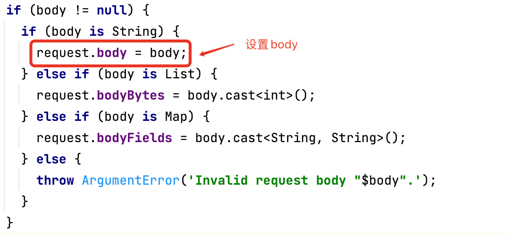
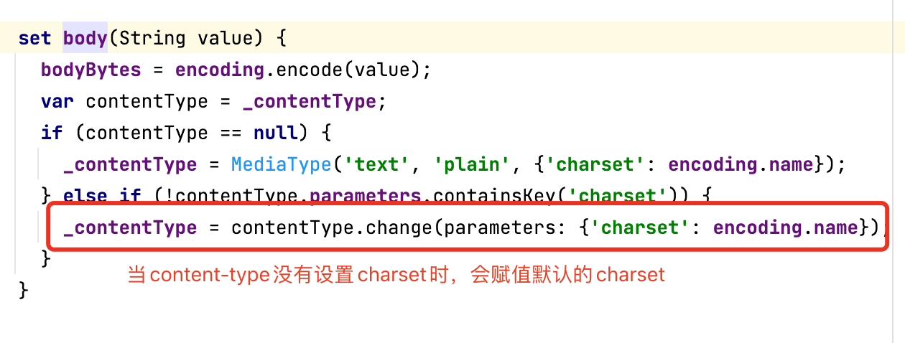

# 实现Dart版本对象存储(COS)插件

## 前言

在 [Flutter Web 在《一起漫部》的性能优化探索与实践](https://juejin.cn/post/7149441892994777125) 一文中，
在做加载优化时需要实现资源文件cdn化，意味着要将资源文件上传到腾讯的COS或者阿里的OSS这样的第三方对象存储服务器。 
目前公司使用的是腾讯的对象存储(COS)，原本想用官方提供的SDK去实现资源上传功能，但是官方并没有提供Dart版本的SDK， 
去`pub.dev`搜了下关于cos的相关插件，也没有找到功能相对完善的插件，于是便打算手写一个Dart版本对象存储(COS)插件。

## 简介

在官方提供的API功能过于丰富和时间有限的情况下，只实现了部分功能：

- 支持`Bucket`接口的基本操作，增加、删除、查询存储桶等
- 支持`Bucket`接口的访问控制(acl)
- 支持`Bucket`接口的跨域资源共享(cors)
- 支持`Bucket`接口的防盗链(referer)
- 支持`Object`接口的基本操作，上传、删除、查询存储对象等
- 支持`Object`接口的访问控制(acl)

## 结构

工程主要包括示例(example)、核心代码(lib)和单元测试(test)三部分

```text
├── CHANGELOG.md
├── LICENSE
├── README.md
├── analysis_options.yaml
├── example                                         // 示例
├── lib                                             // 核心代码
│   ├── src
│   │   ├── api
│   │   ├── client
│   │   ├── model
│   │   └── src.dart
│   └── tencent_cos_plus.dart
├── pubspec.lock
├── pubspec.yaml
├── tencent_cos_plus.iml
└── test                                            // 单元测试
```

### 示例

示例目前仅包括`tencent_cos_plus_example.dart`文件，主要是介绍如何使用插件，包括初始化配置、存储桶Api调用和存储对象 Api调用。

```text
├── example
│   └── tencent_cos_plus_example.dart
```

### 核心代码

核心代码(lib)部分由`client`、`api`和`model`三层构成：

- `client`层封装了http请求和接口签名功能
- `api`层实现了存储桶(bucket)和存储对象(object)部分api的调用
- `model`层负责xml数据和实体对象的解析

```text
├── api
│   ├── api.dart
│   ├── cos_abstract_api.dart
│   ├── cos_api_factory.dart
│   ├── cos_api_mixin.dart
│   ├── cos_bucket_api.dart
│   └── cos_object_api.dart
├── client
│   ├── client.dart
│   └── cos_client.dart
├── model
│   ├── common
│   │   ├── cos_access_control_policy.dart
│   │   ├── cos_common.dart
│   │   ├── cos_config.dart
│   │   ├── cos_cors_configuration.dart
│   │   ├── cos_exception.dart
│   │   └── cos_referer_configuration.dart
│   ├── model.dart
│   ├── request
│   │   ├── cos_bucket_acl_header.dart
│   │   ├── cos_create_bucket_configuration.dart
│   │   ├── cos_delete.dart
│   │   ├── cos_get_object.dart
│   │   └── cos_restore_request.dart
│   └── response
│       ├── cos_copy_object_result.dart
│       ├── cos_delete_result.dart
│       ├── cos_list_all_my_buckets_result.dart
│       ├── cos_list_bucket_result.dart
│       └── cos_list_versions_result.dart
```

### 单元测试

单元测试包括`cos_bucket_api_test.dart`和`cos_object_api_test.dart`两个文件，主要是覆盖了存储桶(bucket)
和存储对象(object)部分api的单元测试

```text
└── test
    ├── cos_bucket_api_test.dart
    └── cos_object_api_test.dart
```

## 使用说明

关于如何使用，请参考 [README](https://github.com/TryImpossible/flutter-diy/tree/main/tencent_cos_plus#readme)

## 碰到的问题

在开发过程中，实现需要提交xml数据的接口时，出现**签名不匹配**的问题。
```xml
<?xml version='1.0' encoding='utf-8' ?>
<Error>
	<Code>SignatureDoesNotMatch</Code>
	<Message>The Signature you specified is invalid.</Message>
	<StringToSign>sha1
1666158568;1666218568
488ab174d5f7a6ec0966aeeb82600e185114d7d1
</StringToSign>
	<FormatString>put
/
cors=
content-length=454&amp;content-md5=DfuiC7IOBwIeiVanWPG%2FKg%3D%3D&amp;content-type=application%2Fxml%3B%20charset%3Dutf-8&amp;date=Wed%2C%2019%20Oct%202022%2005%3A49%3A28%20GMT&amp;host=test-app-1251021022.cos.ap-guangzhou.myqcloud.com
</FormatString>
	<Resource>/</Resource>
	<RequestId>NjM0ZjhmZThfNDgzNjQwMGJfMTMwZWFfNDhmODEyZg==</RequestId>
	<TraceId>OGVmYzZiMmQzYjA2OWNhODk0NTRkMTBiOWVmMDAxODc0OWRkZjk0ZDM1NmI1M2E2MTRlY2MzZDhmNmI5MWI1OTBjYzE2MjAxN2M1MzJiOTdkZjMxMDVlYTZjN2FiMmI0MjFmNzE4ZjVmM2M0ZTcxNjYwMmQ3N2QzYjA3NzYyNmM=</TraceId>
</Error>
```
出现这个问题后，先是确认了签名文档提供的签名规则是否一致，然后使用 [COS 签名工具](https://cos5.cloud.tencent.com/static/cos-sign/) 
去验证签名结果是否一致，发现在都没有问题。最后通过api接口返回的错误信息，发现参与签名的`content-type`和提交给api的`content-type`
不一致，导致签名不匹配。




通过断点调试，排查到是使用的 [http](https://pub.flutter-io.cn/packages/http) 插件造成的，在设置`body`时
如果`content-type`没有`charset`时会赋值默认的`charset`，问题找到了。

## 其它

- 目前不足的是上传文件和下载文件时，没有进度的回调

## 总结 

整个插件实现起来不难，主要需要花时间阅读腾讯对象存储(COS)文档，根据Api文档进行封装和测试，这里开源出来给需要的人提供帮助。

- pub: [tencent_cos_plus](https://pub.flutter-io.cn/packages/tencent_cos_plus)
- git: [tencent_cos_plus](https://github.com/TryImpossible/flutter_tencent_cos_plus)