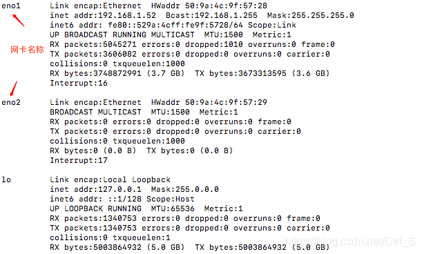
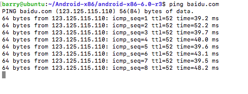
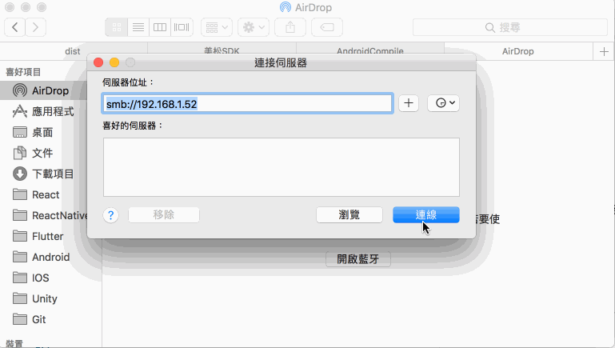

## 前言

由于需要定制 Android 系统，专门购买了台服务器用于编译源码，也就这样，开始接触了 Linux 服务器。在每天不断的接触下，学习到了很关于 Linux 服务器的知识，这里记录下来。

## 设置网络

### 查看网卡



如图所示，该服务器有两块网卡 eno1 和 eno2。没有配置之前，eno2 没有显示任何网络信息表示没有启动该网卡，eno1 没设置之前也是这样的

### 配置网卡

执行以下命令编辑网络配置文件

```
sudo vi /etc/network/interfaces
```

默认的文件内容：

```
# The loopback network interface
auto lo
iface lo inet loopback
```

现在将 eno1 网卡配置进去，配置网卡分两种，静态 IP 和动态 IP：

**静态 IP**

```
auto eno1 # 自启动eno1网卡
iface eno1 inet static # 静态设置IP
address 192.168.1.52 # IP地址
netmask 255.255.255.0 # 子网掩码
gateway 192.168.1.1 # 网关
dns-nameserver 192.168.1.1 # dns服务器
```

**动态 IP**

```
auto eno1 # 自启动eno1网卡
iface eno1 inet dhcp # 动态获取IP
```

为了方便 ssh 连接，这里选择动态 IP 的方式，配置好了**记得:wq 保存退出**

### 重启网络服务

```
/etc/init.d/networking restart  
```

或者

```
ifdown eno1  # 关闭网卡eno1
ifup   eno1  # 启动网卡eno1
sudo service network-manager restart
```

完成以上操作后，尝试 ping 下百度检查网络是否能工作

```
ping baidu.com
```


如图所示，现在网络是正常工作的了。如果上述操作完后，网络还是不能工作，执行`sudo reboot`重启服务器

## 添加用户

执行以下指令，添加用户 barry

```
su - # 切换root用户
adduser barry # 添加用户
```

## 配置 SSH

### 更新软件源

```
sudp apt-get update
```

### 安装 ssh-server 服务

```
sudo apt-get install openssh-server
```

### 查看 ssh 服务是否启动

```
sudo ps -e | grep ssh
```

如果有 sshd 说明服务已经启动，如果没有启动的话，执行`sudo service ssh start`指令启动服务

### 允许 root 用户登录

1.执行`vi /etc/ssh/sshd_config`指令编辑 ssh 配置文件，

2.将`PermitRootLogin no` 替换成`PermitRootLogin yes` 29 行

`sshd_config`文件还有其它配置，像 ssh 服务端口号`Port 22`，这里就不详细介绍

### 登录 SSH

Mac 电脑自带 ssh 功能，执行`ssh <用户名>@<IP 地址>`指令连接服务器

```
ssh barry@192.168.1.52
```

然后输入用户密码，就可以登录了


Windows 使用 Putty 远程登录，这里就不详细介绍了

## 配置 Samba 共享目录

### 安装 samba

执行以下指令安装：

```
sudo apt-get install samba
```

### 编译配置文件

执行以下指令打开`smb.conf`配置文件

```
sudo vi /etc/samba/smb.conf
```

设置共享目录、读写权限等

```
[Android Source]
    comment = This directory is store Android Source Code
    path = /home/barry
    public = yes
    browseable = yes
    public = yes
    read only = no
    valid users = samba
    create mask = 0777
    directory mask = 0777
    available = yes
```

### 添加用户名

执行`sudo smbpasswd -a 用户名`指令添加用户，例如：

```
sudo smbpasswd -a samba
```

还需要输入密码，最好记录下密码

### 重启 samba 服务

执行以下指令：

```
sudo service smbd restart
```

### 通过 samba 访问共享文件夹

Mac 下，进入 Finder -> 前行 -> 连接伺服器，输入`smb://192.168.1.52`，点击连接，输入用户名和密码即可



### 遇到的问题

```
[root@ubuntu ~]# smbpasswd -a samba
New SMB password:
Retype new SMB password:
Failed to add entry for user test.
```

解决办法:

这是因为没有加相应的系统账号，所以会提示 Failed to add entry for user 的错误，只需增加相应的系统账号 samba 就可以了:

```
[root@ubuntu ~]# groupadd samba -g 6000
[root@ubuntu ~]# useradd samba -u 6000 -g 6000 -s /sbin/nologin -d /dev/null
```

## 查看硬件信息

- 主板的序列号：dmidecode | grep -i 'serial number'

- 硬盘信息： df -lh

- CPU 信息：cat /proc/cpuinfo 或者 dmesg | grep -i 'cpu' 或者 dmidecode -t processor

- 内存信息：cat /proc/meminfo 或者 free -h

- 显卡信息：lspci |grep -i 'VGA' 或者 dmesg | grep -i 'VGA'

- 网卡信息：lspci | grep -i 'eth'

- PCI 信息：lspci

- 键盘和鼠标：cat /proc/bus/input/devices

- 各设备的中断请求（IRQ）：cat /proc/interrupts

- 硬件汇总信息：dmesg | more

- 显示外设信息， 如 usb，网卡等信息：lspci

- 已加载的驱动：lsmod 或者 lshw

- 机器的产品名称及序列号：cat /sys/class/dmi/id/product\_\*

- 机器的 BIOS 信息：cat /sys/class/dmi/id/bios\_\*

- DMA 信息：cat /proc/dma

- 支持的文件系统：cat /proc/filesystems

## 总结

这段时间敲的命令很多，没有时间去整理，大概就这么多了。像其它常用的 Linux 指令，敲多了也越来越熟练。现在深刻体会到指令的好处，不仅高大上，很多时候比图形化界面的效率高多了。真的是喜欢上敲指令了，而且吧，想成为个优秀的程序员 Linux 指令是必不可少的。现在算是很好的开始，希望以后再接再励吧。
