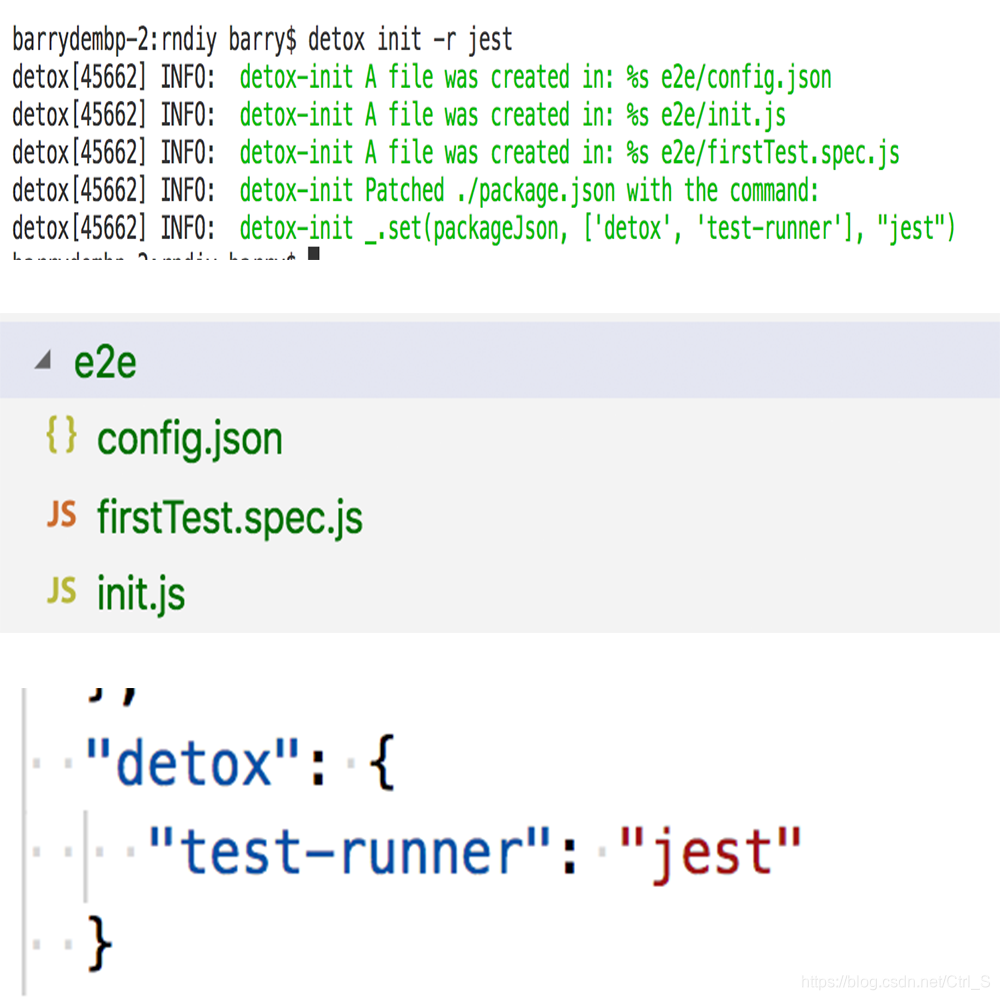
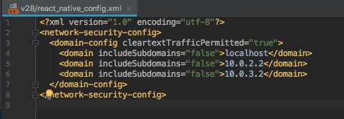
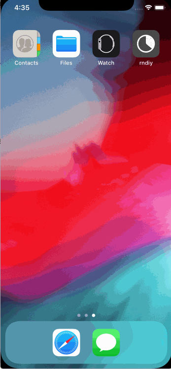
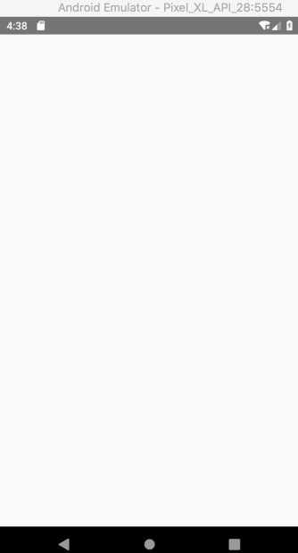

## 前言

> 在移动设备上进行自动化测试最困难的部分是测试金字塔的顶端——E2E。E2E 测试的核心问题是片状性——测试通常不是确定性的。我们相信，要想迎面解决这个问题，唯一的方法就是从黑盒测试转移到灰盒测试。

Detox 是移动应用程序的灰盒端到端测试和自动化框架。当你的手机应用程序在真实设备/模拟器上运行时，使用 Detox 测试它，就像一个真实的用户一样，这大降低了我们对手工 QA 的依赖。

Detox 有以下特点：

- 跨平台：用 JavaScript 编写跨平台测试。目前支持 IOS, Android 已接近完成
- 在真机上运行：像真正的用户一样在设备/模拟器上测试你的应用程序，目前 IOS 尚不支持真机
- 自动同步：通过监控应用程序中的异步操作，在核心处停止
- 为 CI 而生：在像 Travis 这样的 CI 平台上执行 E2E 测试，Jenkins
- 独立测试运行器：使用 Mocha、AVA 或任何其他您喜欢的 JavaScript 测试运行器
- 可调试：Modern async-await API 允许异步测试中的断点 按预期工作

[Detox 官方文档](https://wix.github.io/Detox/docs/introduction/getting-started)

## 环境

在 IOS 上运行 Detox 需要以下支持：

- Mac 系统，要求至少 macOS EI Captian 10.11 版本
- 安装 Xcode，版本至少是 8.3 或以上
- 安装`Xcode command line tool`，可以在终端执行`gcc -v`查看是否安装
- 用于测试的 ReactNative 应用

## 安装依赖

### Homebrew

`Homebrew`是 macOS 的包管理器，我们需要它来安装其他命令行工具，请安装最新的`Homebrew`，安装命令如下：

```
/usr/bin/ruby -e "$(curl -fsSL https://raw.githubusercontent.com/Homebrew/install/master/install)"
```

### Node.js

`Detox`运行在 Node 上，需要安装 Node 8.3.0 或更高的版本，安装命令如下：

```
brew update && brew instsall node
```

### applesimutils

`applesimutils`用于`Apple`模拟器的`utils`集合，`Detox`使用它与模拟器进行通信，安装命令如下

```
brew tap wix/brew
brew install applesimutils
```

### detox-cli

`detox-cli`是`Detox`命令行工具，它能够在`npm`环境之外的使用命令行，应该全局安装，安装命令如下：

```
yarn add -g detox-cli
```

## 集成到项目

### 安装 detox

工程根目录下，在终端执行以下安装命令：

```
yarn add --dev detox
```

### 安装测试运行器

`Detox`支持 Jest 和 Mocha 两种测试运行器开箱即用，这里使用 Jest

```
yarn add --dev jest
```

### 配置 Detox

#### IOS 端

Detox 对 IOS 十分友好，只要添加 Detox 就行了，不需要做额外配置

#### Android 端

1.在`android/settings/gradle`添加：

```
include ':detox'
project(':detox').projectDir = new File(rootProject.projectDir, '../node_modules/detox/android/detox')
```

2.在`android/app/build.gradle`添加以下代码至`defaultConfig`：

```
  testBuildType System.getProperty('testBuildType', 'debug')  //this will later be used to control the test apk build type
      missingDimensionStrategy "minReactNative", "minReactNative46" //read note
      testInstrumentationRunner "android.support.test.runner.AndroidJUnitRunner"
```

3.在`android/app/build.gradle`添加以下代码至`dependencies`

```
  androidTestImplementation(project(path: ":detox"))
  androidTestImplementation 'junit:junit:4.12'
  androidTestImplementation 'com.android.support.test:runner:1.0.2'
  androidTestImplementation 'com.android.support.test:rules:1.0.2'
```

4.在`android/build.gralde`添加以下代码至`allprojects > repositories`：

```
buildscript {
    repositories {
	    // ...
        google()
    }
}
```

5.如果项目还没有使用`Kotlin`，请将`Kotlin gradle`插件添加到 `android/build.gradle`中，代码如下：

```
buildscript {
    // ...
    ext.kotlinVersion = '1.3.0' // Your app's version
    ext.detoxKotlinVersion = ext.kotlinVersion // Detox' version: should be 1.1.0 or higher!

    dependencies: {
        // ...
        classpath "org.jetbrains.kotlin:kotlin-gradle-plugin:$kotlinVersion"
    }
}
```

6.添加文件`android/app/src/androidTest/java/com/rndiy/DetoxTest.java`，编写如下代码：

```
package com.rndiy;
import android.support.test.filters.LargeTest;
import android.support.test.rule.ActivityTestRule;
import android.support.test.runner.AndroidJUnit4;

import com.wix.detox.Detox;

import org.junit.Rule;
import org.junit.Test;
import org.junit.runner.RunWith;

@RunWith(AndroidJUnit4.class)
@LargeTest
public class DetoxTest {

    @Rule
    public ActivityTestRule<MainActivity> mActivityRule = new ActivityTestRule<>(MainActivity.class, false, false);

    @Test
    public void runDetoxTests() {
        Detox.runTests(mActivityRule);
    }
}
```

7.需要特别注意的问题：

- **Detox 要求`minSdkVersion`版本不低于 18**
- **minReactNative44: 支持 React Native 0.44-0.45**
- **minReactNative46: 支持 React Native 0.46+**
- **Problem: Duplicate files copied in ...**

  在`android/app/build.gradle`添加以下代码到`android`节点

  ```
  packagingOptions {
      exclude 'META-INF/LICENSE'
  }
  ```

- **Could not resolve com.android.support:support-annotations:27.1.1.
  Could not resolve com.squareup.okhttp3:okhttp:3.4.1.**

  Detox 9.x.x 以后 升级`gradle`的版本， 在`android/build.gradle`作以下修改:

  ```
  com.android.tools.build:gradle:3.0.1
  to
  com.android.tools.build:gradle:3.2.1
  ```

- **Program type already present: android.support.test.rule.ActivityTestRule\$LifecycleCallback**

  Detox 9.x.x 以后升级`com.android.support.test`的版本， 在`android/app/build.gradle`作以下修改:

  ```
  androidTestImplementation 'com.android.support.test:runner:1.0.1'
  androidTestImplementation 'com.android.support.test:rules:1.0.1'
  to
  androidTestImplementation 'com.android.support.test:runner:1.0.2'
  androidTestImplementation 'com.android.support.test:rules:1.0.2'
  ```

#### JS 端

1.执行`detox init -r jest`，自动生成以下测试相关文件：

- 工程根目录下自动创建`e2e`文件夹，包括`config.json`、`firstTest.spec.js`和`init.js`三个文件
- `package.json`里的`detox`属性下自动添加`"test-runner": "jest"`代码

如图所示：


2.这里 Detox 是基于 Jest 测试运行器，为了避免二者冲突，需要修改`jest.config.js`文件，具体修改如下：

```
use

testPathIgnorePatterns: ['\\.snap$', '<rootDir>/node_modules/'],

replace

testPathIgnorePatterns: ['\\.snap$', '<rootDir>/node_modules/', '<rootDir>/e2e'], // ignore e2e folder
```

3.在`package.json`中的`detox`下写入配置信息， 参考如下：

```
"detox": {
  "configurations": {
    "ios.sim.debug": {
      "binaryPath": "ios/build/Build/Products/Debug-iphonesimulator/rndiy.app",
      "build": "xcodebuild -workspace ios/rndiy.xcworkspace -UseNewBuildSystem=NO -scheme rndiy -configuration Debug -sdk iphonesimulator -derivedDataPath ios/build",
      "type": "ios.simulator",
      "name": "iPhone X"
    },
    "ios.sim.release": {
      "binaryPath": "ios/build/Build/Products/Release-iphonesimulator/rndiy.app",
      "build": "export RCT_NO_LAUNCH_PACKAGER=true && xcodebuild -workspace ios/rndiy.xcworkspace -UseNewBuildSystem=NO -scheme rndiy -configuration Release -sdk iphonesimulator -derivedDataPath ios/build -quiet",
      "type": "ios.none",
      "name": "iPhone X"
    },
    "android.emu.debug": {
      "binaryPath": "android/app/build/outputs/apk/debug/app-debug.apk",
      "build": "pushd android && ./gradlew assembleDebug assembleAndroidTest -DtestBuildType=debug && popd",
      "type": "android.emulator",
      "name": "Pixel_XL_API_28"
    },
    "android.emu.release": {
      "binaryPath": "android/app/build/outputs/apk/release/app-release.apk",
      "build": "pushd android && ./gradlew assembleRelease assembleAndroidTest -DtestBuildType=release && popd",
      "type": "android.attached",
      "name": "2df6e6e4"
    }
  },
  "specs": "e2e",
  "test-runner": "jest"
}
```

详细 Detox 配置说明，请参考[文档](https://wix.github.io/Detox/docs/introduction/project-setup)

4.在`package.json`中的`scripts`下写入命令， 参考如下：

```
"scripts": {
  "start-detox": "detox run-server -p 8099 -l verbose",
    "detox-build-ios": "detox build --configuration ios.sim.debug",
    "detox-build-android": "detox build --configuration android.emu.debug",
    "detox-test-ios": "detox test --loglevel verbose --configuration ios.sim.debug --debug-synchronization 1000",
    "detox-test-android": "detox test --loglevel verbose --configuration android.emu.debug --debug-synchronization 1000",
    "detox-ios-debug": "detox build --configuration ios.sim.debug && detox test --loglevel verbose --configuration ios.sim.debug --debug-synchronization 1000",
    "detox-android-debug": "detox build --configuration android.emu.debug && detox test --loglevel verbose --configuration android.emu.debug",
    "detox-ios-release": "detox build --configuration ios.sim.release && detox test --loglevel verbose --configuration ios.sim.release",
    "detox-android-release": "detox build --configuration android.emu.release && detox test --loglevel verbose --configuration android.emu.release"
}
```

详细 Detox-Cli 配置说明，请参考[文档](https://wix.github.io/Detox/docs/introduction/preparing-for-ci)

**特别注意，踩坑**

当升级到 Android API 28 时，需要配置 networkSecurityConfig 才能访问服务器。RN 从 0.58 版本开始在 Android API 28 环境下编译，在`android/app/src/debug/res/xml-v28/react_native_config.xml`文件中已经配置了相关信息，如图


开始我是想着配置 detox 服务的 ip 地址和端口的，如下代码所示：

```
 "session": {
    "sessionId": "rndiy",
    "server": "ws://192.168.192.247:8099"
  },
```

但是在 Android 工程里`react_native_config.xml`没有指定`192.168.192.247`的`domain`，所以我死活都连接不 Android 设备，后来经过 android 断点调试才发现问题，也是不容易。

解决这个问题，有两种方式：

1. 我直接把`session`的配置去掉，使用 detox 默认的配置

2. 直接把`"server": "ws://192.168.192.247:8099"`修改为`"server": "ws://localhost:8099"`

后来我仔细研究了下，觉得在`detox`配置`session`的意义不是很大。首先 detox 服务都是在本地的，也就是 localhost，所以不需要指定具体的 IP 地址；如果指定端口的话，意味着你启动 detox 服务的时候必须和配置的端口号一致，不然还是连接不上；看来也就是`sessionId`有点作用了，可以区别并行下的自动化测试。所以，我这里把`session`配置去掉了。当然，这只是我的个人观点，也希望大家不要遇到这样的问题

## 开始测试

自动化测试大概分为启动 detox 服务、构建应用、执行测试用例三步，下面就来具体讲讲

### 启动 detox 服务

启动独立的 detox 服务
`detox run-server [可选]`

| 选项           | 描述                                                    |
| -------------- | ------------------------------------------------------- |
| -p, --port     | 端口号，默认 8099                                       |
| -l, --loglevel | 日志等级：fatal, error, warn, info, verbose, trace 可选 |

在`package.json`文件中的`scripts`下配置命令，`start-detox: detox run-server -p 8099 -l verbose`，直接执行`yarn start-detox`即可启动 detox 服务

### 构建应用

运行定义在`configuration.build`的命令

`detox build -c [选项]`，这里的`选项`是指`detox.configurations`配置的命令，我一共配置了 4 条命令，分别是`ios.sim.debug`、`ios.sim.release`、
`android.emu.debug`和`android.emu.release`

在`package.json`文件中的`scripts`下配置命令，`"detox-build-ios": "detox build --configuration ios.sim.debug"`和`"detox-build-android": "detox build --configuration android.emu.debug"`，执行`yarn detox-build-ios`即可构建 IOS 应用，执行`yarn detox-build-android`即可构建 Android 应用

### 执行测试用例

`detox test -c [选项]`，开启执行测试用例

在`package.json`文件中的`scripts`下配置命令，`"detox-test-ios": "detox test --loglevel verbose --configuration ios.sim.debug --debug-synchronization 1000",`和`"detox-test-android": "detox test --loglevel verbose --configuration android.emu.debug --debug-synchronization 1000",`，执行`yarn detox-test-ios`即可启动 IOS 自动化测试，执行`yarn detox-test-android`即可启动 Android 自动化测试

如图所示：




## 总结

集成 Detox 自动化测试暂时就讲这么多，虽然遇到了挺多的问题，但是还是有很多收获的。作为一个有追求的程序员，不怕遇到问题，解决问题我们才能成长的更快，就是要折腾。相信只要我们使用好自动化测试，一定能给我们提供很多的帮助。哈哈，就这样了。
