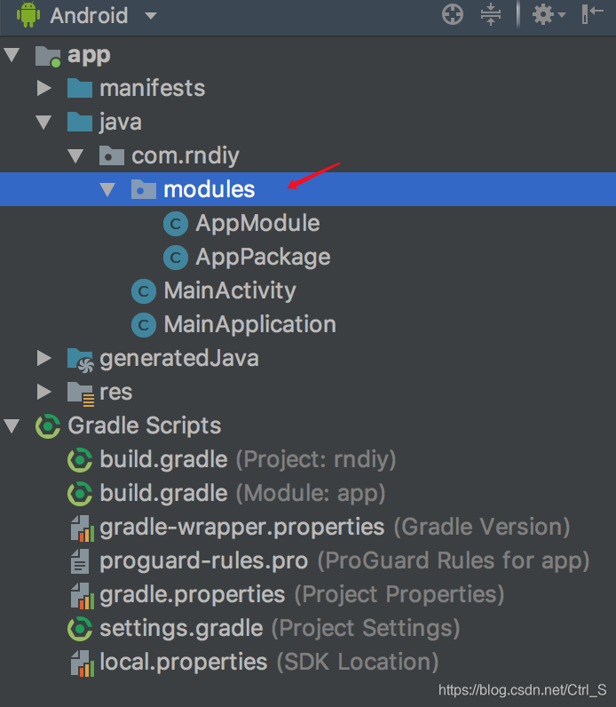
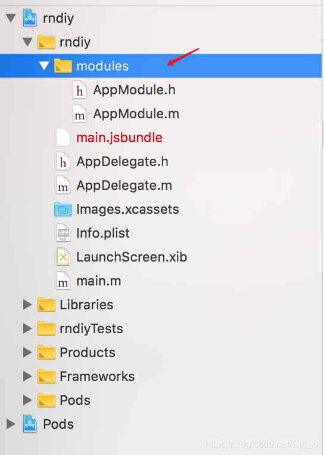

## 前言

> 上节我们简单的对工程初始化作了些补充，这节我们来思考下工程文件的划分以及命名。可能我们平常开发中不会太多注重这些，但是对于有**代码洁癖**的我来说这是不能容忍的，我们现在来简单讨论下。
>
> 1. 什么是文件夹？
> 2. 文件夹以什么命令合适？
> 3. 文件夹多少层合适？

## 什么是文件夹

> 文件夹，这个问题可能问得有点傻？可能大多数人回答的是，将许多`不同`的文件放在一起就形成了文件夹。其实这说法是错误的，关键就在于说是`不同`。我觉得许多文件放在一起正是因为它们有`相同`的地方，也就是分门别类了。

## 文件夹以什么命名合适

> 以什么名字命名其实很重要！就那种你一看名字就能猜到这个文件夹是干什么用的，给人的感觉就很舒服，完全不用关注里面的内容。到时候面对什么模块拆分、模块重构，直接找到对应的文件夹就可以了。

## 文件夹多少层合适

> 我个人认为文件夹层级不能超过**5**层。一般我都以**3**层为主，如果超过**5**层的话，就意味着你的文件存在扁平化的必要了。就像我们的数据结构一样，一旦层级过深的话在数据的查找、修改都会面临许多的问题，所以**扁平化**很重要。

## 工程根目录

```
├── .buckconfig
├── .flowconfig
├── .git
├── .gitattributes
├── .gitignore
├── .watchmanconfig
├── App.js
├── README.md
├── __tests__
├── android
├── app.json
├── babel.config.js
├── dist ①
├── index.js
├── ios
├── local-cli ②
├── metro.config.js
├── node_modulesa
├── package.json
├── private ③
├── src ④
└── yarn.lock
```

工程目录结构还是相对简单的，我只在初始化工程的基础上增加了 4 个文件夹：

- `dist`是公共文件的输出位置，比如打包生成的 `apk、ipa`文件；

- `local-cli`存放是工程使用的`scripts`文件，比如构建脚本、`route` 生成脚本等；

- `private`文件夹有存放是个人的临时文件，是被`git`忽略的；
- `src`是最重要的文件夹，工程几乎所有的代码都存放在里面，我们重点讲解也是要此文件夹。

## src 目录

```
src/
├── components
│   ├── UI
│   └── widgets
├── configs
├── modules
├── navigators
├── redux
│   ├── actions
│   ├── reducers
│   └── store
├── resources
│   ├── i18n
│   ├── images
│   ├── svg
│   └── themes
├── screens
├── services
└── utilities
```

根据以往项目经验，我将`src`目录暂时建立了共 18 个子目录：

- `components`是工程中的基础组件文件夹，这里我又再新建了`UI`和`widgets`文件夹。`UI`指的是 App 所采用的统一风格的组件，比如`ant design`、`teaset`等等.我是建议`UI`封装一层此类组件，便于定制化；`widgets`指的是 App 使用的自定义组件，比如`Navbar`、`ViewPager`等等
- `configs`是工程中配置文件夹
- `modules`是工程中的模块文件夹，主要对应的是自定义的原生模块
- `navigators`是工程中导航控制器文件夹，比如`react-navigation`
- `redux`分为`actions`、`reducers`和`store`，这是`redux`的经典分法，对于每个文件夹的意义的话建议是学习`redux`相关知识
- `resources`是工程中的资源文件夹，这里分为`i18n`、`images`、`svg`和`themes`.`i18n`指多语言，也就是国际化；`images`指的就是图片资源；`svg`是指图标，非常建议 App 中大量使用 svg 图标，轻量且加载快；`themes`即主题，建议 App 至少建立一套主题
- `screen`是工程中页面文件夹，App 当中的所有页面都放在里面
- `services`是工程中服务类文件夹，比如有关网络请求的 Api 的相关文件
- `utilities`是工程中的工具类文件夹，比如`TimeUtil`、`StringUtil`之类的文件

`src`文件夹大概也就这些，日后可能还会作出修改，大家仅供参考。

## Native 目录

`Native`当然指的就是`Android`和`IOS`工程。由于使用`RN`开发，`native`工程的编码相对很少。目前，我仅在`native`工程中新建`modules`文件夹即可，日后根据需要自行添加。




如图所示，我分别在`Android`和`IOS`工程下分别建立了`modules`文件夹，并且增加了`AppModule`.

## 总结

整个工程的目录结构也就讲解完了，也没有什么特别的，我只不过把以往项目中的目录结构简单整理了下而已。其实没有固定的分法，要说的固定的话只有**分层思想**，切忌层与层之间耦合严重
