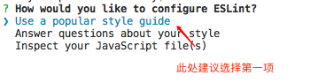
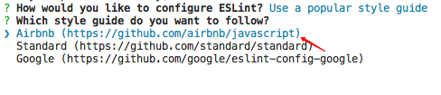
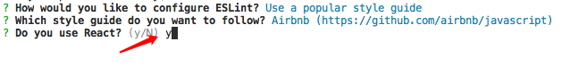
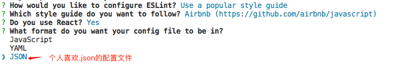
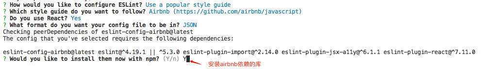

## ESLint

ESLint 是一个按照规则给出报告的代码检测工具，使用它可以避免低级错误和统一代码风格，这对公司团队开发非常实用。

### 安装
**1.全局安装**

如果你想使用ESLint适用于你所有的项目，建议全局安装ESLint

`npm i -g eslint`

初始化配置文件

`./node_modules/.bin/eslint --init`
	
**2.局部安装**

单个项目使用

`npm i -D eslint`
	
初始化配置文件

`eslint --inint`

**3.安装步骤**






至此，安装完成。

### 配置
**指定执行环境**

```
"env": {
	browser: true,
	node: true,
},
```
**指定全局变量**

* 使用注释来配置

```
/* global __DEV__, fetch */
/* global __DEV__:true, fetch:true */
```
* 使用配置文件来配置

```
"globals": {
    "__DEV__": true,
    "fetch": true
  },
```

**规则**

规则等级有三种：

* "off"或者0： 关闭规则 
* "warn"或者1： 打开规则，作为警告。
* "error"或者2： 打开规则，作为错误。

例如：

* 使用注释来配置

```
/* eslint no-console: "off", no-undef: "error" */
/* eslint no-console: 0, no-undef: 2 */
```

* 使用配置文件来配置

```
"rules": {
    "no-console": "off",
    "no-undef": "off",
    "no-useless-constructor": "off",
    "import/no-extraneous-dependencies": [
      "error",
      {
        "devDependencies": true,
        "optionalDependencies": false,
        "peerDependencies": false
      }
    ],
    "react/jsx-filename-extension": "off"
  }
```

当然，也可以在注释中关闭规则 

```
/* eslint-disable */
/* eslint-enable */

/* eslint-disable no-alert, no-console */
/* eslint-enable no-alert, no-console */
```

### 使用方法
在`package.json`文件中加入以下代码

```
"scripts": {
    "lint": "eslint --ext .js ./src --fix",
}
```
命令行工具下执行`yarn run lint`, 即会检测代码。

## Prettier
Prettier是代码格式化工具，能够统一个人或者团队的代码风格。

### 安装
`npm i -D prettier`

### 配置

在工程根目录下创建`.prettierrc.js`文件，
```
module.exports = {
  printWidth: 120, // 换行字符串阈值
  semi: true, // 句末加分号
  singleQuote: true, // 用单引号
  trailingComma: 'none', // 最后一个对象元素加逗号
  bracketSpacing: true, // 对象，数组加空格
  jsxBracketSameLine: false, // jsx > 是否另起一行
  arrowParens: 'avoid', // (x) => {} 是否要有小括号
  requirePragma: false, // 是否要注释来决定是否格式化代码
  proseWrap: 'preserve' // 是否要换行
};
```

**插件**

`npm i -D eslint eslint-config-prettier eslint-plugin-prettier`

**配置`.eslintrc.json`**

```
"extends": ["airbnb", "prettier", "plugin:prettier/recommended"],
"plugins": ["react", "prettier"],
```

### 使用方法
在package.json文件中加入以下代码

```
"scripts": {
  "prettier": "prettier --write src/**/*.js"
}
```

在命令行工具下执行 `prettier --write src/**/*.js`, `src`对应的是你文件夹


## Pre-commit Hook

Pre-commit Hook是在`Git`提交之前用来检查待提交代码是否有错误的工具。

### 安装
`npm i -D husky lint-staged pretty-quick`

### 配置
在package.json文件中加入以下代码

```
 "scripts": {
    "precommit": "pretty-quick --staged",
  },
  "lint-staged": {
    "*.{js,json,md}": [
      "prettier --write",
      "git add"
    ],
    "*.js": [
      "yarn lint --fix",
      "git add"
    ]
  },
```

### 使用

使用`Git`提交代码的时候，会自动检测代码并进行格式化，如何有错误会终止`push`


## VSCode

* 安装ESLint Prettier插件
* 在设置中添加

```
"editor.formatOnSave": true,
"javascript.format.enable": false,
"prettier.eslintIntegration": true
```

当你保存时会自动修复一些空格缩进、单双引号及句末是否加`;`的错误，但是你变量未声明等错误需要手动去修复。

**效果图**


### 写在最后
刚开始使用ESLint的时候，你可能会遇到各种各样的红色波浪线错误。不要觉得莫名其妙，这说明你的代码规范有很多值得去补充修正的地方，好好去弄明白`eslint`中的规则，形成良好的代码风格，这不管是对个人还是团队而言都是值得使用的。

